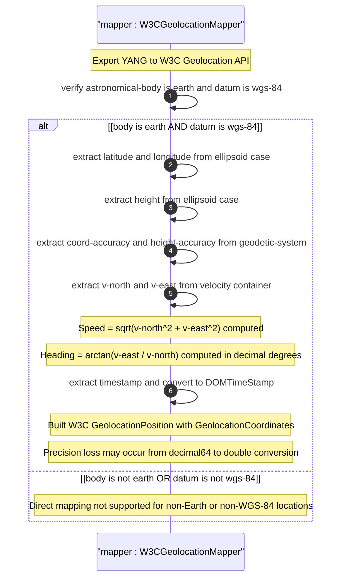

# User Story: Map Geographic Location to and from W3C Geolocation API

## Parent Epic
- [ ] #26 - [Geographic Location Module](https://github.com/gintatkinson/3dgs-030/blob/main/docs/epics/epic-03-geographic-location.md) (W3C Geolocation API mapping enables portability for web-based location applications)

## Domain Object Mapping
- **Primary Domain Objects:** `geo-location/location/ellipsoid` (latitude, longitude, height), `geo-location/reference-frame/geodetic-system` (coord-accuracy, height-accuracy), `geo-location/velocity` (v-north, v-east derive heading and speed), `geo-location/timestamp` (maps to DOMTimeStamp)
- **Actor/Role:** Web Integration Layer (system converting between YANG geo-location data and W3C Geolocation API interfaces)

## BDD Scenario (OOA/OOD Realization)
**As a** Web Integration Layer
**I want to** map geographic location data between the YANG grouping and the W3C Geolocation API (GeolocationCoordinates and GeolocationPosition)
**So that** browser-based applications consuming the W3C API can interoperate with systems using the YANG geo-location grouping

**Given** a geo-location on Earth with geodetic-datum "wgs-84", latitude=40.73297, longitude=-74.007696, height=35.0, coord-accuracy=10.0, height-accuracy=5.0, v-north=1.5, v-east=0.0, and timestamp="2026-07-30T14:30:00Z"
**When** the web integration layer maps the YANG data to W3C format
**Then** the W3C GeolocationCoordinates has latitude=40.73297, longitude=-74.007696, altitude=35.0, accuracy=10.0, altitudeAccuracy=5.0, heading=0.0, speed=1.5
**And** the W3C GeolocationPosition timestamp is the UNIX epoch milliseconds equivalent of "2026-07-30T14:30:00Z"
**And** only Earth-based locations with geodetic-datum "wgs-84" can be directly mapped to W3C format

## UML Sequence Diagram


## Operational Context
From RFC 9179, Section 5.1.2:

> W3C defines a geolocation API in W3CGEO. We show a snippet of code below that defines the geolocation data for this API. This is used by many applications (e.g., Google Maps API).

> W3C API values can be mapped to the YANG grouping with the caveat that some loss of precision (in the extremes) may occur due to the YANG grouping using decimal64 values rather than doubles.

> Conversely, only YANG values for Earth using the default 'wgs-84' as the 'geodetic-datum' can be directly mapped to the W3C values as W3C does not provide the extra features necessary to map the broader set of values supported by the YANG grouping.

## Required Features Matrix
- [ ] #21 - [Geo-Location Container](https://github.com/gintatkinson/3dgs-030/blob/main/docs/features/feat-06-geo-location-container.md) (the root container whose data is mapped to W3C GeolocationPosition format)
- [ ] #24 - [Location Coordinates](https://github.com/gintatkinson/3dgs-030/blob/main/docs/features/feat-09-location-coordinates.md) (ellipsoidal latitude/longitude/height map to W3C latitude/longitude/altitude)
- [ ] #25 - [Velocity Vector](https://github.com/gintatkinson/3dgs-030/blob/main/docs/features/feat-10-velocity-vector.md) (v-north and v-east derive W3C heading and speed values)
- [ ] #23 - [Geodetic System](https://github.com/gintatkinson/3dgs-030/blob/main/docs/features/feat-08-geodetic-system.md) (coord-accuracy maps to W3C accuracy; height-accuracy maps to altitudeAccuracy; geodetic-datum must be wgs-84)
- [ ] #22 - [Reference Frame](https://github.com/gintatkinson/3dgs-030/blob/main/docs/features/feat-07-reference-frame.md) (astronomical-body must be "earth" for valid W3C mapping)

## Source References
Structural Schema: [ietf-geo-location@2022-02-11.yang](https://github.com/YangModels/yang/blob/main/standard/ietf/RFC/ietf-geo-location%402022-02-11.yang) (Clause: grouping geo-location)
Normative Specification: [RFC 9179: A YANG Grouping for Geographic Locations](https://datatracker.ietf.org/doc/rfc9179/) (Clause: Section 5.1.2)
Cross-Reference: [W3C Geolocation API Specification](https://www.w3.org/TR/geolocation/)

> [!WARNING]
> **Mermaid Block Closing Constraints & Code Fence Integrity:**
> - Every Mermaid diagram MUST be strictly closed with ``` on a new line. Leaking Mermaid blocks or stray/unclosed code fences will fail downstream validation checks.
> - **Semicolon Restriction**: Do NOT use semicolons (`;`) in sequence diagram `Note` statements or message text statements. Semicolons are not allowed.
