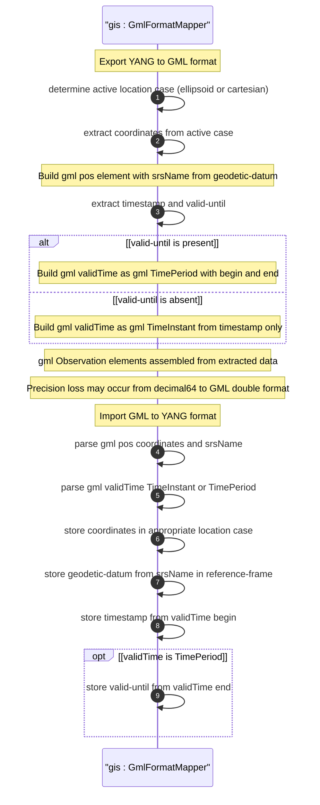

# User Story: Map Geographic Location to and from Geography Markup Language (GML)

## Parent Epic
- [ ] #26 - [Geographic Location Module](https://github.com/gintatkinson/3dgs-030/blob/main/docs/epics/epic-03-geographic-location.md) (GML mapping enables portability for OGC-compliant geographic information systems)

## Domain Object Mapping
- **Primary Domain Objects:** `geo-location/location` (choice: ellipsoid or cartesian maps to `gml:pos`), `geo-location/reference-frame/geodetic-system` (geodetic-datum maps to CRS `srsName`), `geo-location/timestamp` (maps to `gml:validTime` with `gml:TimeInstant`), `geo-location/valid-until` (maps to `gml:TimePeriod` end)
- **Actor/Role:** GIS Integration System (system converting between YANG geo-location data and GML position and observation elements)

## BDD Scenario (OOA/OOD Realization)
**As a** GIS Integration System
**I want to** map geographic location data between the YANG grouping and Geography Markup Language (GML) representations
**So that** location data can be exchanged with OGC-compliant GIS systems using GML

**Given** a geo-location with Earth-based ellipsoidal coordinates and geodetic-datum "wgs-84-96", latitude=48.8583424, longitude=2.3375084, height=35.0, timestamp="2026-07-30T14:30:00Z", and valid-until="2026-08-01T00:00:00Z"
**When** the GIS integration system maps the YANG data to GML format
**Then** a `gml:pos` element is created with srsName="wgs-84-96" and coordinate values "48.8583424 2.3375084 35.0"
**And** a `gml:validTime` element contains a `gml:TimePeriod` with begin matching the timestamp and end matching valid-until
**And** when parsing back from GML the YANG decimal64 precision constraints are honored with potential precision loss from GML double format

## UML Sequence Diagram


## Operational Context
From RFC 9179, Section 5.1.3:

> GML defines, among many other things, a position type 'gml:pos', which is a sequence of 'double' values. This sequence of values represents coordinates in a given CRS. The CRS is either inherited from containing elements or directly specified as attributes 'srsName' and optionally 'srsDimension' on the 'gml:pos'.

> GML 'gml:pos' values can be mapped directly to the YANG grouping with the caveat that some loss of precision (in the extremes) may occur due to the YANG grouping using decimal64 values rather than doubles.

> GML also defines an observation value in 'gml:Observation', which includes a timestamp value 'gml:validTime'. The instantaneous 'gml:TimeInstant' is mappable to and from the YANG grouping 'timestamp' value, and values down to the resolution of seconds for 'gml:TimePeriod' can be mapped using the 'valid-until' node of the YANG grouping.

## Required Features Matrix
- [ ] #21 - [Geo-Location Container](https://github.com/gintatkinson/3dgs-030/blob/main/docs/features/feat-06-geo-location-container.md) (the root container whose data including timestamp and valid-until is mapped to GML)
- [ ] #24 - [Location Coordinates](https://github.com/gintatkinson/3dgs-030/blob/main/docs/features/feat-09-location-coordinates.md) (ellipsoidal or Cartesian coordinates map to gml:pos double sequence)
- [ ] #23 - [Geodetic System](https://github.com/gintatkinson/3dgs-030/blob/main/docs/features/feat-08-geodetic-system.md) (geodetic-datum maps to srsName CRS attribute)
- [ ] #22 - [Reference Frame](https://github.com/gintatkinson/3dgs-030/blob/main/docs/features/feat-07-reference-frame.md) (astronomical-body defines the base body for the GML CRS definition)

## Source References
Structural Schema: [ietf-geo-location@2022-02-11.yang](https://github.com/YangModels/yang/blob/main/standard/ietf/RFC/ietf-geo-location%402022-02-11.yang) (Clause: grouping geo-location)
Normative Specification: [RFC 9179: A YANG Grouping for Geographic Locations](https://datatracker.ietf.org/doc/rfc9179/) (Clause: Section 5.1.3)
Cross-Reference: [ISO 19136:2007 - Geography Markup Language](https://www.iso.org/standard/32554.html)

> [!WARNING]
> **Mermaid Block Closing Constraints & Code Fence Integrity:**
> - Every Mermaid diagram MUST be strictly closed with ``` on a new line. Leaking Mermaid blocks or stray/unclosed code fences will fail downstream validation checks.
> - **Semicolon Restriction**: Do NOT use semicolons (`;`) in sequence diagram `Note` statements or message text statements. Semicolons are not allowed.
