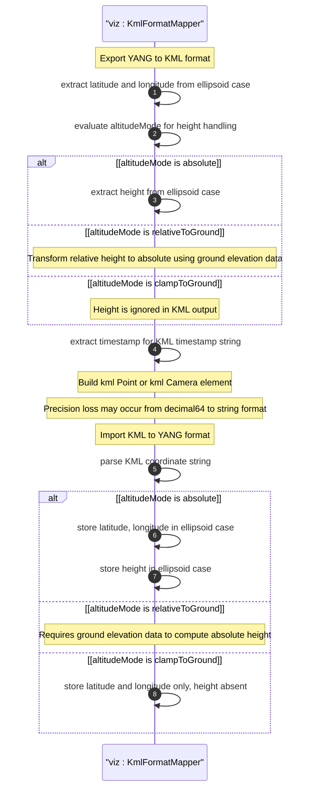

# User Story: Map Geographic Location to and from KML Format

## Parent Epic
- [ ] #26 - [Geographic Location Module](https://github.com/gintatkinson/3dgs-030/blob/main/docs/epics/epic-03-geographic-location.md) (KML mapping enables portability for geospatial visualization platforms)

## Domain Object Mapping
- **Primary Domain Objects:** `geo-location/location/ellipsoid` (latitude, longitude, height), `geo-location/reference-frame/geodetic-system` (geodetic-datum "LonLat84_5773"), `geo-location/timestamp` (maps to KML timestamp string)
- **Actor/Role:** Geospatial Visualization System (system converting between YANG geo-location data and KML Point/Camera elements)

## BDD Scenario (OOA/OOD Realization)
**As a** Geospatial Visualization System
**I want to** map geographic location data between the YANG grouping and KML representations
**So that** location data can be visualized in Google Earth and other KML-compatible geospatial platforms

**Given** a geo-location with Earth-based ellipsoidal coordinates latitude=40.73297, longitude=-74.007696, height=35.0, altitude mode "absolute", and timestamp="2026-07-30T14:30:00Z"
**When** the visualization system maps the YANG data to KML format
**Then** a `kml:Point` or `kml:Camera` element is created with coordinates "40.73297,-74.007696,35.0" and altitudeMode "absolute"
**And** when altitudeMode is "clampToGround" the height value is ignored during mapping
**And** when altitudeMode is "relativeToGround" the mapping requires external ground elevation data to compute an absolute height
**And** the YANG timestamp maps directly to the KML timestamp string

## UML Sequence Diagram


## Operational Context
From RFC 9179, Section 5.1.4:

> KML has some special handling for the height value that is useful for visualization software, 'kml:altitudeMode'. The values for 'kml:altitudeMode' include 'clampToGround', which indicates the height is ignored; 'relativeToGround', which indicates the height value is relative to the location's ground level; or 'absolute', which indicates the height value is an absolute value within the geodetic datum. The YANG grouping can directly map the ignored and absolute cases but not the relative-to-ground case.

> The YANG grouping and KML values can be directly mapped in both directions (when using a supported altitude mode) with the caveat that some loss of precision (in the extremes) may occur due to the YANG grouping using decimal64 values rather than strings. For the relative height cases, the application doing the transformation is expected to have the data available to transform the relative height into an absolute height, which can then be expressed using the YANG grouping.

## Required Features Matrix
- [ ] #21 - [Geo-Location Container](https://github.com/gintatkinson/3dgs-030/blob/main/docs/features/feat-06-geo-location-container.md) (the root container whose data including timestamp is mapped to KML elements)
- [ ] #24 - [Location Coordinates](https://github.com/gintatkinson/3dgs-030/blob/main/docs/features/feat-09-location-coordinates.md) (ellipsoidal latitude/longitude/height map to KML coordinate strings)
- [ ] #23 - [Geodetic System](https://github.com/gintatkinson/3dgs-030/blob/main/docs/features/feat-08-geodetic-system.md) (geodetic-datum determines coordinate interpretation for KML absolute height mode)
- [ ] #22 - [Reference Frame](https://github.com/gintatkinson/3dgs-030/blob/main/docs/features/feat-07-reference-frame.md) (astronomical-body must be "earth" for KML mapping)

## Source References
Structural Schema: [ietf-geo-location@2022-02-11.yang](https://github.com/YangModels/yang/blob/main/standard/ietf/RFC/ietf-geo-location%402022-02-11.yang) (Clause: grouping geo-location, case ellipsoid)
Normative Specification: [RFC 9179: A YANG Grouping for Geographic Locations](https://datatracker.ietf.org/doc/rfc9179/) (Clause: Section 5.1.4)
Cross-Reference: [KML 2.3 - OGC](https://docs.opengeospatial.org/is/12-007r2/12-007r2.html)

> [!WARNING]
> **Mermaid Block Closing Constraints & Code Fence Integrity:**
> - Every Mermaid diagram MUST be strictly closed with ``` on a new line. Leaking Mermaid blocks or stray/unclosed code fences will fail downstream validation checks.
> - **Semicolon Restriction**: Do NOT use semicolons (`;`) in sequence diagram `Note` statements or message text statements. Semicolons are not allowed.
