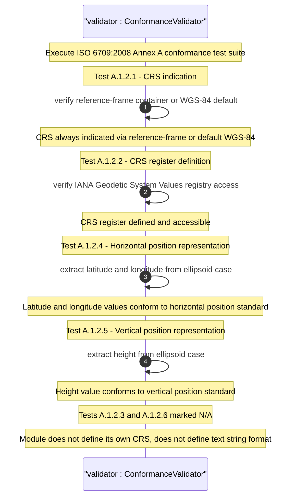

# User Story: Validate ISO 6709:2008 Conformance for Geographic Point Location

## Parent Epic
- [ ] #26 - [Geographic Location Module](https://github.com/gintatkinson/3dgs-030/blob/main/docs/epics/epic-03-geographic-location.md) (ISO 6709 conformance validates the geo-location grouping's compliance with the international standard)

## Domain Object Mapping
- **Primary Domain Objects:** `geo-location/reference-frame/geodetic-system` (provides CRS indication per test A.1.2.1), `geo-location/location/ellipsoid` (horizontal position representation per test A.1.2.4), `geo-location/reference-frame` (CRS register references per test A.1.2.2)
- **Actor/Role:** Standards Compliance Validator (system or test harness verifying ISO 6709:2008 conformance requirements)

## BDD Scenario (OOA/OOD Realization)
**As a** Standards Compliance Validator
**I want to** verify that the geo-location grouping conforms to ISO 6709:2008 requirements for geographic point location representation
**So that** the implementation is certified as compliant with the international geolocation standard

**Given** a geo-location grouping implementation with reference-frame and ellipsoid coordinate support
**When** the conformance validator executes the ISO 6709:2008 Annex A test suite
**Then** Test A.1.2.1 passes: the Coordinate Reference System (CRS) is always indicated via the reference-frame container or defaults to WGS-84
**And** Test A.1.2.2 passes: the CRS register is defined via the IANA Geodetic System Values registry
**And** Test A.1.2.4 passes: latitude and longitude values conform to the horizontal position representation
**And** Test A.1.2.5 passes: height values conform to the vertical position representation
**And** Tests A.1.2.3 and A.1.2.6 are marked N/A: the module does not define its own CRS and does not define a text string representation

## UML Sequence Diagram


## Operational Context
From RFC 9179, Section 4:

> ISO 6709:2008 provides an appendix with a set of tests for conformance to the standard. The tests and results are given in the following table along with an explanation of inapplicable tests.

| Test    | Description                        | Pass Explanation              |
|---------|------------------------------------|-------------------------------|
| A.1.2.1 | elements required for a geographic point location | CRS is always indicated |
| A.1.2.2 | description of a CRS from a register | CRS register is defined |
| A.1.2.3 | definition of CRS                  | N/A - Don't define CRS |
| A.1.2.4 | representation of horizontal position | latitude/longitude values conform |
| A.1.2.5 | representation of vertical position | height value conforms |
| A.1.2.6 | text string representation         | N/A - No string format |

> For test 'A.1.2.1', the YANG geo-location object either includes a Coordinate Reference System (CRS) ('reference-frame') or has a default defined WGS84.

## Required Features Matrix
- [ ] #21 - [Geo-Location Container](https://github.com/gintatkinson/3dgs-030/blob/main/docs/features/feat-06-geo-location-container.md) (the root container hosting the reference-frame and location choice tested for conformance)
- [ ] #24 - [Location Coordinates](https://github.com/gintatkinson/3dgs-030/blob/main/docs/features/feat-09-location-coordinates.md) (ellipsoidal coordinates are tested for horizontal and vertical position conformance)
- [ ] #23 - [Geodetic System](https://github.com/gintatkinson/3dgs-030/blob/main/docs/features/feat-08-geodetic-system.md) (provides the CRS definition and IANA registry reference)

## Source References
Structural Schema: [ietf-geo-location@2022-02-11.yang](https://github.com/YangModels/yang/blob/main/standard/ietf/RFC/ietf-geo-location%402022-02-11.yang) (Clause: grouping geo-location)
Normative Specification: [RFC 9179: A YANG Grouping for Geographic Locations](https://datatracker.ietf.org/doc/rfc9179/) (Clause: Section 4)
Cross-Reference: [ISO 6709:2008 - Standard representation of geographic point location by coordinates](https://www.iso.org/standard/39242.html)

> [!WARNING]
> **Mermaid Block Closing Constraints & Code Fence Integrity:**
> - Every Mermaid diagram MUST be strictly closed with ``` on a new line. Leaking Mermaid blocks or stray/unclosed code fences will fail downstream validation checks.
> - **Semicolon Restriction**: Do NOT use semicolons (`;`) in sequence diagram `Note` statements or message text statements. Semicolons are not allowed.
