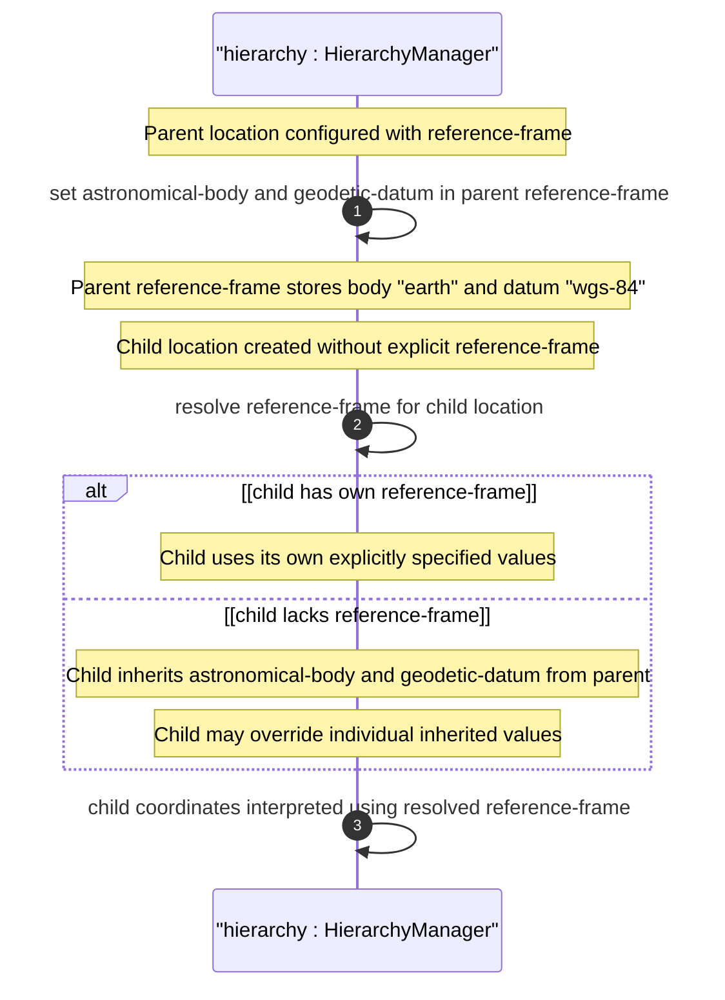

# User Story: Inherit Reference Frame in Nested Location Hierarchies

## Parent Epic
- [ ] #26 - [Geographic Location Module](https://github.com/gintatkinson/3dgs-030/blob/main/docs/epics/epic-03-geographic-location.md) (nested location inheritance is a deployment pattern defined for the geo-location grouping)

## Domain Object Mapping
- **Primary Domain Objects:** `geo-location/reference-frame` (container whose values are inherited from parent), `geo-location` (container that may inherit reference-frame from enclosing context)
- **Actor/Role:** Location Hierarchy Manager (system configuring nested geo-location instances where child locations derive their reference frame from the parent)

## BDD Scenario (OOA/OOD Realization)
**As a** Location Hierarchy Manager
**I want to** define a nested location hierarchy where child geo-location instances inherit the reference frame from their parent container
**So that** the reference frame (astronomical-body, geodetic-datum, accuracy values) does not need to be repeated in every nested location instance

**Given** a building has a geo-location with reference-frame specifying astronomical-body="earth" and geodetic-datum="wgs-84"
**When** a child router is assigned a geo-location within that building without specifying its own reference-frame
**Then** the child router's location coordinates are interpreted using the building's reference frame
**And** the child may optionally override any inherited reference frame value by explicitly specifying its own
**And** if the child specifies its own astronomical-body or geodetic-datum the inherited values are overridden

## UML Sequence Diagram


## Operational Context
From RFC 9179, Section 2.4:

> When locations are nested (e.g., a building may have a location that houses routers that also have locations), the module using this grouping is free to indicate in its definition that the 'reference-frame' is inherited from the containing object so that the 'reference-frame' need not be repeated in every instance of location data.

## Required Features Matrix
- [ ] #21 - [Geo-Location Container](https://github.com/gintatkinson/3dgs-030/blob/main/docs/features/feat-06-geo-location-container.md) (the root container that may be nested and whose reference-frame can be inherited from parent)
- [ ] #22 - [Reference Frame](https://github.com/gintatkinson/3dgs-030/blob/main/docs/features/feat-07-reference-frame.md) (the container whose values are inherited: astronomical-body, alternate-system, geodetic-datum, accuracy)
- [ ] #23 - [Geodetic System](https://github.com/gintatkinson/3dgs-030/blob/main/docs/features/feat-08-geodetic-system.md) (geodetic-datum and accuracy values within the reference frame that are inherited)

## Source References
Structural Schema: [ietf-geo-location@2022-02-11.yang](https://github.com/YangModels/yang/blob/main/standard/ietf/RFC/ietf-geo-location%402022-02-11.yang) (Clause: container reference-frame)
Normative Specification: [RFC 9179: A YANG Grouping for Geographic Locations](https://datatracker.ietf.org/doc/rfc9179/) (Clause: Section 2.4)

> [!WARNING]
> **Mermaid Block Closing Constraints & Code Fence Integrity:**
> - Every Mermaid diagram MUST be strictly closed with ``` on a new line. Leaking Mermaid blocks or stray/unclosed code fences will fail downstream validation checks.
> - **Semicolon Restriction**: Do NOT use semicolons (`;`) in sequence diagram `Note` statements or message text statements. Semicolons are not allowed.
