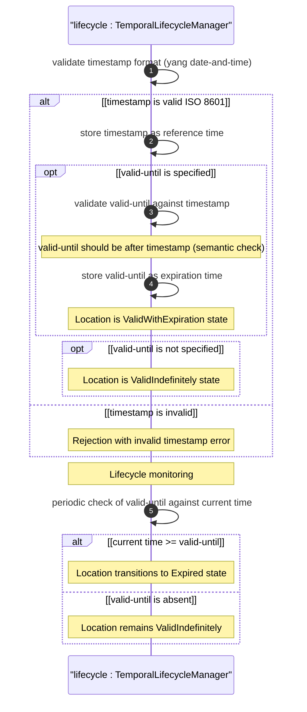

# User Story: Manage Temporal Validity and Expiration of Location Records

## Parent Epic
- [ ] #26 - [Geographic Location Module](https://github.com/gintatkinson/3dgs-030/blob/main/docs/epics/epic-03-geographic-location.md) (timestamp and valid-until are temporal attributes of the geo-location container)

## Domain Object Mapping
- **Primary Domain Objects:** `geo-location/timestamp` (leaf, yang:date-and-time), `geo-location/valid-until` (leaf, yang:date-and-time), `geo-location` (container with temporal lifecycle)
- **Actor/Role:** Location Lifecycle Manager (system or user recording and validating temporal attributes of geo-location data)

## BDD Scenario (OOA/OOD Realization)
**As a** Location Lifecycle Manager
**I want to** record when a location was captured (timestamp) and specify when it expires (valid-until)
**So that** consumers of the location data can verify its freshness and detect stale or expired records

**Given** a geo-location container is being populated with coordinate data
**When** the lifecycle manager sets timestamp to "2026-07-30T14:30:00Z" and valid-until to "2026-08-01T00:00:00Z"
**Then** the location is considered valid within the interval [2026-07-30T14:30:00Z, 2026-08-01T00:00:00Z]
**And** after valid-until passes the location record transitions to the Expired state
**And** if valid-until is absent the location has no specific expiration and remains indefinitely valid
**And** the timestamp provides an audit trail of when the location data was recorded

## UML Sequence Diagram


## UML State Machine Diagram
```mermaid
stateDiagram-v2
    [*] --> Unrecorded
    Unrecorded --> ValidWithExpiration : record [validUntilSpecified == true] / setTimestamp setValidUntil
    Unrecorded --> ValidIndefinitely : record [validUntilSpecified == false] / setTimestamp
    ValidWithExpiration --> Expired : expire [currentTime >= validUntil] / markExpired
    ValidIndefinitely --> ValidIndefinitely : update [newDataAvailable == true] / setTimestamp
    ValidWithExpiration --> ValidWithExpiration : update [newDataAvailable == true AND newValidUntil > currentTime] / setTimestamp setValidUntil
    Expired --> ValidWithExpiration : refresh [newValidUntil > currentTime] / setTimestamp setValidUntil
    Expired --> [*]
    ValidIndefinitely -. stale detection .-> ValidIndefinitely : check [elapsed > threshold] / logStalenessWarning
```

## Operational Context
From RFC 9179, Section 2.6 (YANG tree):

> `+-- timestamp?         yang:date-and-time`
> `+-- valid-until?       yang:date-and-time`

From the YANG module schema:
- `leaf timestamp`: type `yang:date-and-time`, description "Reference time when location was recorded"
- `leaf valid-until`: type `yang:date-and-time`, description "The timestamp for which this geo-location is valid until. If unspecified, the geo-location has no specific expiration time."

From RFC 9179, Section 7 (Security Considerations):

> All the data nodes defined in this YANG module are writable/creatable/deletable (i.e., "config true", which is the default).

## Required Features Matrix
- [ ] #21 - [Geo-Location Container](https://github.com/gintatkinson/3dgs-030/blob/main/docs/features/feat-06-geo-location-container.md) (the root container that hosts the timestamp and valid-until temporal attributes with full lifecycle management)

## Source References
Structural Schema: [ietf-geo-location@2022-02-11.yang](https://github.com/YangModels/yang/blob/main/standard/ietf/RFC/ietf-geo-location%402022-02-11.yang) (Clause: leaf timestamp, leaf valid-until)
Normative Specification: [RFC 9179: A YANG Grouping for Geographic Locations](https://datatracker.ietf.org/doc/rfc9179/) (Clause: Section 2.6, Section 7)

> [!WARNING]
> **Mermaid Block Closing Constraints & Code Fence Integrity:**
> - Every Mermaid diagram MUST be strictly closed with ``` on a new line. Leaking Mermaid blocks or stray/unclosed code fences will fail downstream validation checks.
> - **Semicolon Restriction**: Do NOT use semicolons (`;`) in sequence diagram `Note` statements or message text statements. Semicolons are not allowed.
