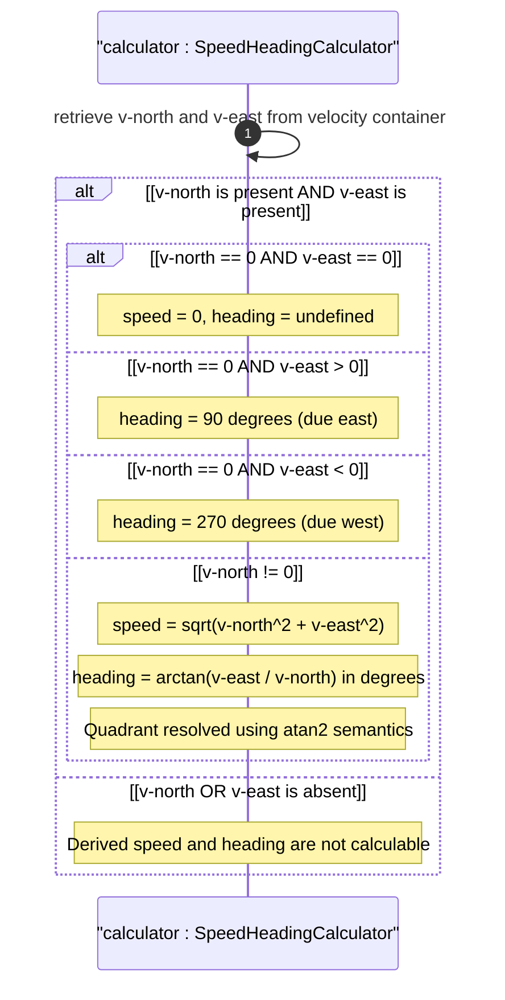

# User Story: Derive Speed and Heading from Velocity Vector Components

## Parent Epic
- [ ] #26 - [Geographic Location Module](https://github.com/gintatkinson/3dgs-030/blob/main/docs/epics/epic-03-geographic-location.md) (speed and heading are derived values computed from the velocity vector sub-container)

## Domain Object Mapping
- **Primary Domain Objects:** `geo-location/velocity/v-north` (input, decimal64 fr12, m/s), `geo-location/velocity/v-east` (input, decimal64 fr12, m/s), `geo-location/reference-frame/geodetic-system` (defines true north for heading reference)
- **Actor/Role:** Motion Analytics Engine (system computing derived speed and heading from raw velocity components)

## BDD Scenario (OOA/OOD Realization)
**As a** Motion Analytics Engine
**I want to** derive two-dimensional speed and heading from the v-north and v-east velocity components
**So that** consumers of geo-location data can query scalar speed and directional heading without performing vector math

**Given** a geo-location has velocity components v-north=1.000000000000 m/s and v-east=1.000000000000 m/s
**When** the analytics engine computes the derived values
**Then** the two-dimensional speed is sqrt(v_north^2 + v_east^2) = 1.414213562373 m/s
**And** the heading is arctan(v_east / v_north) = 45 degrees measured clockwise from true north
**And** when v-north is zero and v-east is positive the heading is 90 degrees (due east)
**And** when both v-north and v-east are zero the speed is 0 and heading is undefined
**And** the derived values are computed with at least 12 decimal digits of intermediate precision

**Given** v-north=0.0 and v-east=2.000000000000
**When** the analytics engine computes the heading
**Then** the special case v-north=0 yields heading=90 degrees for positive v-east and heading=270 degrees for negative v-east

**Given** no velocity container is present or v-north and v-east are both absent
**When** speed and heading are requested
**Then** the system returns not-applicable indicators for both derived values

## UML Sequence Diagram


## Operational Context
From RFC 9179, Section 2.3:

> To derive the two-dimensional heading and speed, one would use the following formulas:
> speed = sqrt(v_north^2 + v_east^2)
> heading = arctan(v_east / v_north)

> For some applications that demand high accuracy and where the data is infrequently updated, this velocity vector can track very slow movement such as continental drift.

### Algorithmic Implementation Requirements

1. **Speed Calculation:**
   - Formula: `speed = sqrt(v_north² + v_east²)`
   - Input precision: decimal64 with 12 fractional digits
   - Output precision: maintain at least 12 fractional digits
   - Result is always non-negative
   - When both inputs are zero: speed = 0.0

2. **Heading Calculation:**
   - Formula: `heading = arctan(v_east / v_north)`
   - Output units: decimal degrees, 0 to 360, measured clockwise from true north
   - Special case v-north == 0, v-east > 0: heading = 90 degrees
   - Special case v-north == 0, v-east < 0: heading = 270 degrees
   - Special case v-north == 0, v-east == 0: heading is undefined
   - Negative v-north: heading is in quadrant II (90 to 180) or III (180 to 270) based on v-east sign
   - Implement atan2 semantics for correct quadrant resolution

3. **Precision Management:**
   - Intermediate calculations should use at least double-precision floating point
   - Final results should be rounded to match the input precision level (12 fractional digits for velocity-derived values)

## Required Features Matrix
- [ ] #25 - [Velocity Vector](https://github.com/gintatkinson/3dgs-030/blob/main/docs/features/feat-10-velocity-vector.md) (provides v-north and v-east input components with decimal64 fr12 precision)
- [ ] #21 - [Geo-Location Container](https://github.com/gintatkinson/3dgs-030/blob/main/docs/features/feat-06-geo-location-container.md) (hosts the velocity container from which derived values are computed)

## Source References
Structural Schema: [ietf-geo-location@2022-02-11.yang](https://github.com/YangModels/yang/blob/main/standard/ietf/RFC/ietf-geo-location%402022-02-11.yang) (Clause: container velocity, leaves v-north and v-east)
Normative Specification: [RFC 9179: A YANG Grouping for Geographic Locations](https://datatracker.ietf.org/doc/rfc9179/) (Clause: Section 2.3, formulas for speed and heading)

> [!WARNING]
> **Mermaid Block Closing Constraints & Code Fence Integrity:**
> - Every Mermaid diagram MUST be strictly closed with ``` on a new line. Leaking Mermaid blocks or stray/unclosed code fences will fail downstream validation checks.
> - **Semicolon Restriction**: Do NOT use semicolons (`;`) in sequence diagram `Note` statements or message text statements. Semicolons are not allowed.
