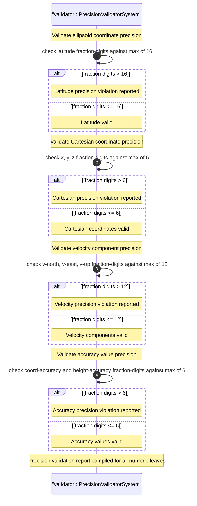

# User Story: Enforce Coordinate Precision Constraints per Schema Type Definitions

## Parent Epic
- [ ] #26 - [Geographic Location Module](https://github.com/gintatkinson/3dgs-030/blob/main/docs/epics/epic-03-geographic-location.md) (precision management applies across all coordinate-bearing containers in the grouping)

## Domain Object Mapping
- **Primary Domain Objects:** `geo-location/location/ellipsoid` (latitude fr16, longitude fr16, height fr6), `geo-location/location/cartesian` (x fr6, y fr6, z fr6), `geo-location/velocity` (v-north fr12, v-east fr12, v-up fr12), `geo-location/reference-frame/geodetic-system` (coord-accuracy fr6, height-accuracy fr6)
- **Actor/Role:** Precision Enforcement Engine (system validating that all coordinate values conform to their schema-defined fraction-digit limits)

## BDD Scenario (OOA/OOD Realization)
**As a** Precision Enforcement Engine
**I want to** validate that all coordinate, velocity, and accuracy values conform to their schema-defined decimal64 fraction-digit constraints
**So that** data integrity is maintained and consumers can rely on guaranteed precision levels

**Given** the YANG schema defines specific fraction-digit limits for each numeric leaf
**When** the enforcement engine validates stored geo-location data
**Then** latitude and longitude values are verified to have at most 16 fractional decimal digits
**And** x, y, z Cartesian coordinates are verified to have at most 6 fractional decimal digits
**And** height is verified to have at most 6 fractional decimal digits
**And** v-north, v-east, v-up velocity components are verified to have at most 12 fractional decimal digits
**And** coord-accuracy and height-accuracy are verified to have at most 6 fractional decimal digits
**And** values exceeding their fraction-digit limits are rejected with a precision violation error

**Given** a user enters latitude=40.12345678901234567 (17 fractional digits)
**When** the enforcement engine validates the value against the decimal64 fraction-digits 16 constraint
**Then** the value is rejected
**And** an error message indicates the maximum of 16 fractional digits for latitude

**Given** coordinate data is imported from an external source with lower precision than the schema allows
**When** the value is stored without trailing zero padding
**Then** the enforcement engine accepts the value as-is without requiring full-precision padding
**And** the stored value accurately represents the source data precision

## UML Sequence Diagram


## Operational Context

### Precision Constraints Matrix

| Schema Node              | Type       | Fraction Digits | Units            |
|--------------------------|------------|-----------------|------------------|
| latitude                 | decimal64  | 16              | decimal degrees  |
| longitude                | decimal64  | 16              | decimal degrees  |
| height (ellipsoid)       | decimal64  | 6               | meters           |
| x (cartesian)            | decimal64  | 6               | meters           |
| y (cartesian)            | decimal64  | 6               | meters           |
| z (cartesian)            | decimal64  | 6               | meters           |
| v-north                  | decimal64  | 12              | meters/second    |
| v-east                   | decimal64  | 12              | meters/second    |
| v-up                     | decimal64  | 12              | meters/second    |
| coord-accuracy           | decimal64  | 6               | (unitless)       |
| height-accuracy          | decimal64  | 6               | meters           |

### Precision Management Requirements

1. **Input Validation:** All decimal64 values must be checked against their schema-defined fraction-digit maximum before storage.
2. **Import Handling:** When importing from external formats (geo: URI, W3C, GML, KML), truncation or rounding may be necessary to fit YANG decimal64 constraints.
3. **Interoperability:** When exporting to external formats with lower precision (e.g., W3C doubles), document the potential precision loss.
4. **Accuracy Uncertainty:** The coord-accuracy and height-accuracy values represent measurement uncertainty; the stored coordinate precision should not exceed the known accuracy.

## Required Features Matrix
- [ ] #24 - [Location Coordinates](https://github.com/gintatkinson/3dgs-030/blob/main/docs/features/feat-09-location-coordinates.md) (defines precision constraints for latitude fr16, longitude fr16, height fr6, and Cartesian x/y/z fr6)
- [ ] #25 - [Velocity Vector](https://github.com/gintatkinson/3dgs-030/blob/main/docs/features/feat-10-velocity-vector.md) (defines precision constraints for v-north fr12, v-east fr12, v-up fr12)
- [ ] #23 - [Geodetic System](https://github.com/gintatkinson/3dgs-030/blob/main/docs/features/feat-08-geodetic-system.md) (defines precision constraints for coord-accuracy fr6 and height-accuracy fr6)
- [ ] #22 - [Reference Frame](https://github.com/gintatkinson/3dgs-030/blob/main/docs/features/feat-07-reference-frame.md) (astronomical-body pattern validation participates in overall data quality)
- [ ] #21 - [Geo-Location Container](https://github.com/gintatkinson/3dgs-030/blob/main/docs/features/feat-06-geo-location-container.md) (the root container whose timestamps also require temporal format validation)

## Source References
Structural Schema: [ietf-geo-location@2022-02-11.yang](https://github.com/YangModels/yang/blob/main/standard/ietf/RFC/ietf-geo-location%402022-02-11.yang) (Clause: all decimal64 type definitions with fraction-digits constraints)
Normative Specification: [RFC 9179: A YANG Grouping for Geographic Locations](https://datatracker.ietf.org/doc/rfc9179/) (Clause: Section 2.2, Section 2.3, Section 2.1)
Cross-Reference: [RFC 6020: YANG Data Modeling Language](https://datatracker.ietf.org/doc/rfc6020/) (decimal64 type definition)

> [!WARNING]
> **Mermaid Block Closing Constraints & Code Fence Integrity:**
> - Every Mermaid diagram MUST be strictly closed with ``` on a new line. Leaking Mermaid blocks or stray/unclosed code fences will fail downstream validation checks.
> - **Semicolon Restriction**: Do NOT use semicolons (`;`) in sequence diagram `Note` statements or message text statements. Semicolons are not allowed.
