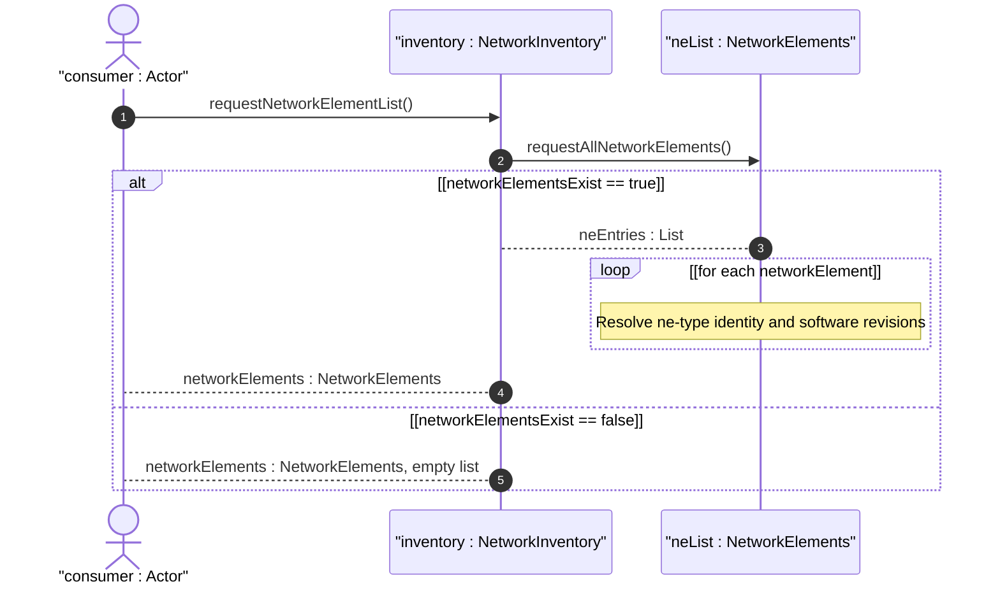
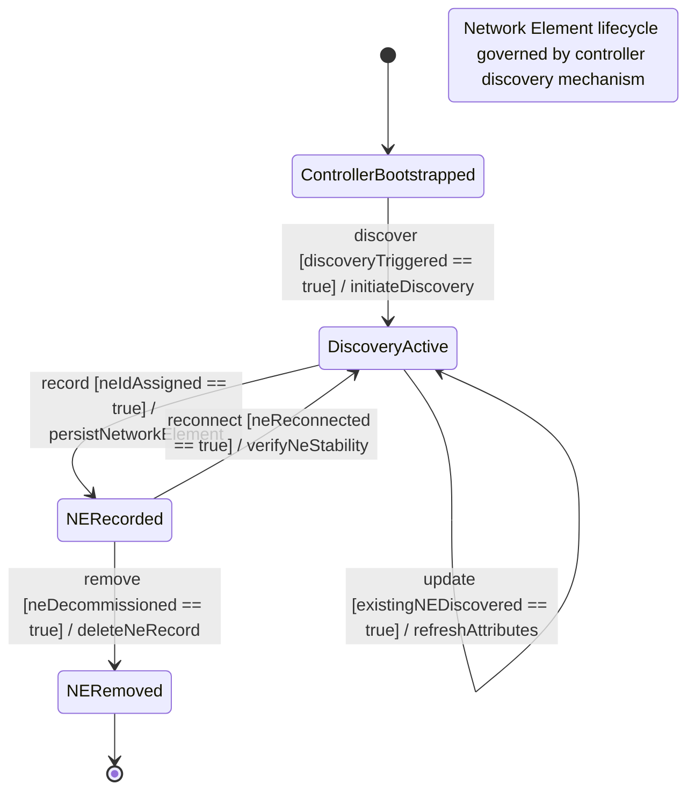

# User Story: Retrieve Network Element List from Inventory Controller

## Parent Epic
- [ ] #49 - [Network Inventory: Network Elements Management](https://github.com/gintatkinson/3dgs-030/blob/main/docs/epics/epic-04-network-elements-management.md) (the network-element list is the primary data within the NE Management bounded context, keyed by ne-id)

## Domain Object Mapping
- **Primary Domain Objects:** `network-inventory/network-elements/network-element` (list, config false), `ne-id` (key leaf), `ne-type` (identityref leaf), `ne-component-common-entity-attributes` (grouping)
- **Actor/Role:** Inventory Consumer (network operator, OSS application, or northbound system requesting the list of managed network elements)

## BDD Scenario (OOA/OOD Realization)
**As a** Inventory Consumer
**I want to** retrieve the complete list of network elements discovered by the controller
**So that** I can enumerate all managed devices in the network for monitoring, auditing, and planning purposes

**Given** a network controller has discovered multiple network elements in its domain
**When** the Inventory Consumer fetches `/network-inventory/network-elements` operational state
**Then** the response contains the `network-element` list with all discovered NEs
**And** each entry is uniquely identified by its `ne-id` key
**And** each entry includes its `ne-type` classified via the identity system
**And** each entry carries `uuid`, `name`, `alias`, `description`, `mfg-name`, `product-name`, and `product-rev` attributes
**And** each entry may include a `software-rev` list if software modules are reported

## Compliance Verification Table

| Rule | Status |
|------|--------|
| Lifeline aliasing (name : Classifier) | PASS |
| Open return arrows (`-->`) used | PASS |
| Return value assignment signatures | PASS |
| Given-When-Then BDD scenarios present | PASS |
| Mermaid blocks properly closed | PASS |
| No semicolons in Note statements | PASS |
| Combined fragment guards in square brackets | PASS |
| Helper/Calculator delegation for computations | PASS |

## UML Sequence Diagram


## UML State Machine Diagram


## Operational Context
From draft-ietf-ivy-network-inventory-yang, Section 3.2:

> ne-id: The identifier that uniquely identifies the network element (NE) within the network, assigned by the server since the network elements cannot guarantee that their local identifier is unique within the network. The ne-id should be assigned such that the same network element will always be identified through the same identifier, even if the network elements get disconnected from the network controller. Mechanisms to ensure this (e.g., checking the mfg-name, product-name, management IP address, physical location) are implementation specific and outside the scope of standardization.

> ne-type: The type of network element (e.g., physical network element).

## Required Features Matrix
- [ ] #46 - [Network Inventory Container](https://github.com/gintatkinson/3dgs-030/blob/main/docs/features/feat-11-network-inventory-container.md) (the root config-false container that hosts all inventory data, serving as the single entry point for NE list retrieval)
- [ ] #47 - [Network Elements Management](https://github.com/gintatkinson/3dgs-030/blob/main/docs/features/feat-12-network-elements-management.md) (the network-element list with ne-id key, ne-type identityref, and all NE attributes defined in ne-component-common-entity-attributes)

## Source References
Structural Schema: [ietf-network-inventory@2026-05-27.yang](https://github.com/gintatkinson/3dgs-030/blob/main/schema/ietf-network-inventory%402026-05-27.yang) (Clause: container network-elements, list network-element with key ne-id)
Normative Specification: [draft-ietf-ivy-network-inventory-yang-18](https://datatracker.ietf.org/doc/html/draft-ietf-ivy-network-inventory-yang) (Clause: Section 3.2, Section 6)

> [!WARNING]
> **Mermaid Block Closing Constraints & Code Fence Integrity:**
> - Every Mermaid diagram MUST be strictly closed with ``` on a new line. Leaking Mermaid blocks or stray/unclosed code fences will fail downstream validation checks.
> - **Semicolon Restriction**: Do NOT use semicolons (`;`) in sequence diagram `Note` statements or message text statements. Semicolons are not allowed. Replace any semicolons with commas, dashes, or spaces.
