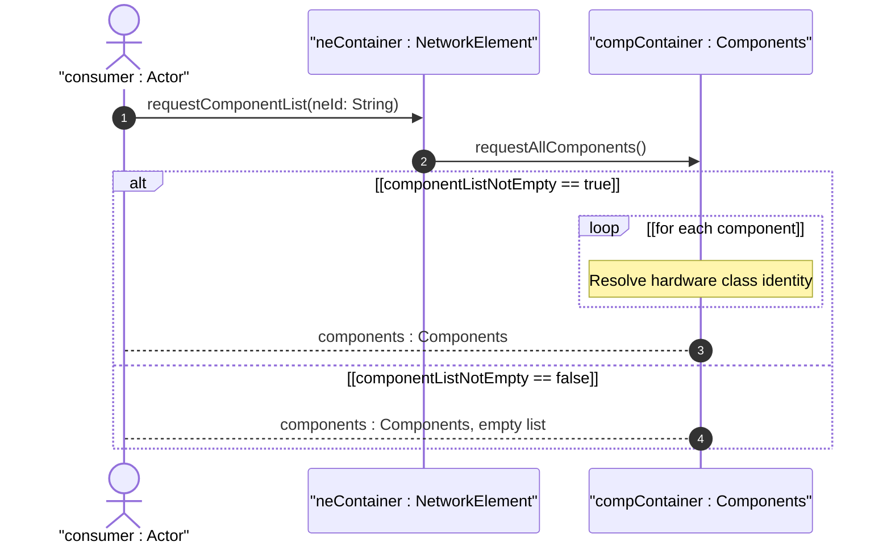

# User Story: Retrieve Hardware Component Inventory for a Network Element

## Parent Epic
- [ ] #50 - [Network Inventory: Component Inventory](https://github.com/gintatkinson/3dgs-030/blob/main/docs/epics/epic-05-component-inventory.md) (the components container nested under each network element holds the hardware component list with all manufacturing and asset metadata)

## Domain Object Mapping
- **Primary Domain Objects:** `components/component` (list keyed by component-id), `component-attributes` (grouping), `ianahw:hardware-class` (identity union member), `parent` (self-referencing leaf-list), `component-attributes` (grouping with mfg-name, hardware-rev, part-number, serial-number, mfg-date, is-fru, asset-id)
- **Actor/Role:** Inventory Consumer (network operator or OSS system retrieving the physical hardware components of a known network element)

## BDD Scenario (OOA/OOD Realization)
**As a** Inventory Consumer
**I want to** retrieve the complete component inventory for a given network element
**So that** I can inspect the physical hardware composition including chassis, slots, boards, ports, CPUs, fans, power supplies, and other hardware entities

**Given** a network element "ne-001" exists with multiple hardware components
**When** the Inventory Consumer fetches `/network-inventory/network-elements/network-element[ne-id='ne-001']/components` operational state
**Then** the response contains the `component` list with all hardware components of that NE
**And** each component is uniquely identified by its `component-id`
**And** each component's `class` is set to an identity derived from `ianahw:hardware-class`
**And** each component may carry `mfg-name`, `product-name`, `hardware-rev`, `mfg-date`, `part-number`, `serial-number`, `asset-id`, `is-fru`, and `uri` attributes
**And** component containment hierarchy is expressed via the `parent` leaf-list referencing sibling component-ids

## Compliance Verification Table

| Rule | Status |
|------|--------|
| Lifeline aliasing (name : Classifier) | PASS |
| Open return arrows (`-->`) used | PASS |
| Return value assignment signatures | PASS |
| Given-When-Then BDD scenarios present | PASS |
| Mermaid blocks properly closed | PASS |
| No semicolons in Note statements | PASS |
| Combined fragment guards in square brackets | PASS |
| Helper/Calculator delegation for computations | PASS |

## UML Sequence Diagram


## Operational Context
From draft-ietf-ivy-network-inventory-yang, Section 3.3.1:

> Other models (e.g., TMF SD2-20) classifies the hardware components into two groups: holder group and equipment group. The holder group contains rack, chassis, slot, sub-slot while the equipment group contains network-element, board and port. This model, likewise RFC 8348, does not follow this classification and manage all the hardware components without distinguishing between holder and equipment groups.

> Figure 1 describes the relationship between typical inventory objects in a physical network element: network element 1:M chassis 1:N slot/board/sub-slot 1:N port.

From the YANG module schema:
- `leaf class`: type `union { type identityref { base ianahw:hardware-class; } type identityref { base nwi:non-hardware-component-class; } }` — mandatory
- `leaf-list parent`: type `leafref { path "../../component/component-id"; require-instance false; }` — self-referencing containment

## Required Features Matrix
- [ ] #46 - [Network Inventory Container](https://github.com/gintatkinson/3dgs-030/blob/main/docs/features/feat-11-network-inventory-container.md) (the root config-false container that provides the structural entry point for component retrieval)
- [ ] #47 - [Network Elements Management](https://github.com/gintatkinson/3dgs-030/blob/main/docs/features/feat-12-network-elements-management.md) (the network-element hosting the components child container, identified by ne-id)
- [ ] #48 - [Component Inventory](https://github.com/gintatkinson/3dgs-030/blob/main/docs/features/feat-13-component-inventory.md) (the components list with component-id key, mandatory class union, full hardware attribute set, parent containment references, and manufacturing metadata)

## Source References
Structural Schema: [ietf-network-inventory@2026-05-27.yang](https://github.com/gintatkinson/3dgs-030/blob/main/schema/ietf-network-inventory%402026-05-27.yang) (Clause: container components, list component keyed by component-id, grouping component-attributes)
Normative Specification: [draft-ietf-ivy-network-inventory-yang-18](https://datatracker.ietf.org/doc/html/draft-ietf-ivy-network-inventory-yang) (Clause: Sections 3.3, 3.3.1, Appendix D, Appendix E, Appendix F)

> [!WARNING]
> **Mermaid Block Closing Constraints & Code Fence Integrity:**
> - Every Mermaid diagram MUST be strictly closed with ``` on a new line. Leaking Mermaid blocks or stray/unclosed code fences will fail downstream validation checks.
> - **Semicolon Restriction**: Do NOT use semicolons (`;`) in sequence diagram `Note` statements or message text statements. Semicolons are not allowed. Replace any semicolons with commas, dashes, or spaces.
