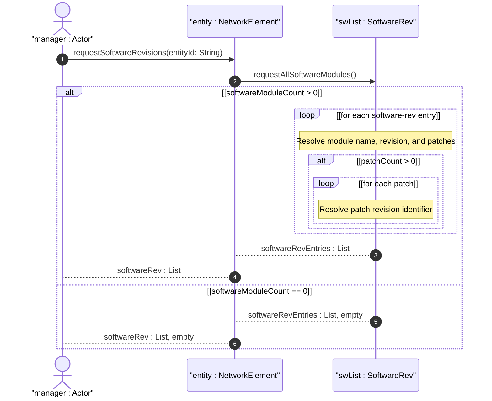
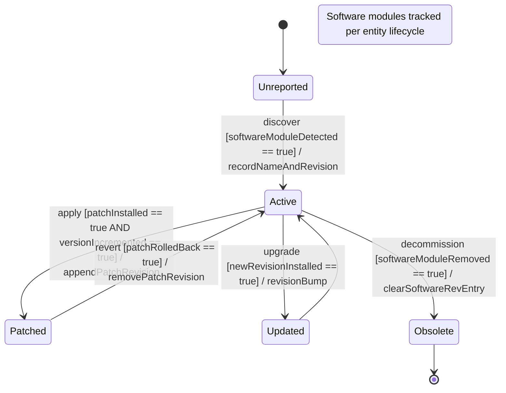

# User Story: Report Software Component Revisions and Patches for Inventory Entities

## Parent Epic
- [ ] #49 - [Network Inventory: Network Elements Management](https://github.com/gintatkinson/3dgs-030/blob/main/docs/epics/epic-04-network-elements-management.md) (NEs carry the software-rev list with name, revision, and nested patch entries)
- [ ] #50 - [Network Inventory: Component Inventory](https://github.com/gintatkinson/3dgs-030/blob/main/docs/epics/epic-05-component-inventory.md) (components also carry the software-rev list, inherited from ne-component-common-entity-attributes via component-attributes)

## Domain Object Mapping
- **Primary Domain Objects:** `software-rev` (list keyed by name), `software-rev/name` (key leaf), `software-rev/revision` (optional leaf), `software-rev/patch` (nested list keyed by revision), `ne-component-common-entity-attributes` (grouping defining the software-rev structure)
- **Actor/Role:** Software Asset Manager (operator or system tracking software images intended to run on NEs and components)

## BDD Scenario (OOA/OOD Realization)
**As a** Software Asset Manager
**I want to** retrieve the software revisions and applied patches for each network element and component
**So that** I can audit the software state, verify compliance, and identify entities requiring updates

**Given** a network element "ne-001" runs an OS module and two FPGA firmware modules
**When** the Software Asset Manager retrieves the software-rev list for "ne-001"
**Then** the list contains three entries keyed by software module name
**And** each entry has an optional `revision` string for the vendor-specific version
**And** any entry may include zero or more `patch` entries keyed by patch revision
**Given** a component "circuit-pack-01" runs a boot-loader and firmware
**When** the software-rev list is retrieved for "circuit-pack-01"
**Then** the list contains two entries with distinct names
**And** each entry may have its own nested `patch` list

## Compliance Verification Table

| Rule | Status |
|------|--------|
| Lifeline aliasing (name : Classifier) | PASS |
| Open return arrows (`-->`) used | PASS |
| Return value assignment signatures | PASS |
| Given-When-Then BDD scenarios present | PASS |
| Mermaid blocks properly closed | PASS |
| No semicolons in Note statements | PASS |
| Combined fragment guards in square brackets | PASS |
| Helper/Calculator delegation for computations | PASS |

## UML Sequence Diagram


## UML State Machine Diagram


## Operational Context
From draft-ietf-ivy-network-inventory-yang, Section 3.3.2:

> Each instance of a network element or a component includes its own "software-rev" list which provides basic software attributes for each entity (network element and component). The scope of the list is to provide information about the software images intended to be running within the related entity. The model supports scenarios where multiple software modules can be images intended to be running within the entity. For example, on a network element an Operating System and an Application software modules can be intended to be running; in the same way, on a component like a circuit pack a boot-loader, a firmware and one or more FPGA software modules can be intended to be running.

> The management of inactive/standby software modules and of the software upgrade or downgrade life-cycle are outside the scope of the base inventory model.

From the YANG module schema:
- `list software-rev`: key `name`; `leaf name` type `string`; `leaf revision` type `string` (optional); `list patch` key `revision`; `leaf revision` type `string`

## Required Features Matrix
- [ ] #47 - [Network Elements Management](https://github.com/gintatkinson/3dgs-030/blob/main/docs/features/feat-12-network-elements-management.md) (the software-rev list is a component of ne-component-common-entity-attributes used by network-element, tracking OS and application modules)
- [ ] #48 - [Component Inventory](https://github.com/gintatkinson/3dgs-030/blob/main/docs/features/feat-13-component-inventory.md) (the software-rev list is inherited into every component via component-attributes, tracking boot-loader, firmware, and FPGA modules)

## Source References
Structural Schema: [ietf-network-inventory@2026-05-27.yang](https://github.com/gintatkinson/3dgs-030/blob/main/schema/ietf-network-inventory%402026-05-27.yang) (Clause: grouping ne-component-common-entity-attributes, list software-rev, list patch)
Normative Specification: [draft-ietf-ivy-network-inventory-yang-18](https://datatracker.ietf.org/doc/html/draft-ietf-ivy-network-inventory-yang) (Clause: Section 3.3.2)

> [!WARNING]
> **Mermaid Block Closing Constraints & Code Fence Integrity:**
> - Every Mermaid diagram MUST be strictly closed with ``` on a new line. Leaking Mermaid blocks or stray/unclosed code fences will fail downstream validation checks.
> - **Semicolon Restriction**: Do NOT use semicolons (`;`) in sequence diagram `Note` statements or message text statements. Semicolons are not allowed. Replace any semicolons with commas, dashes, or spaces.
