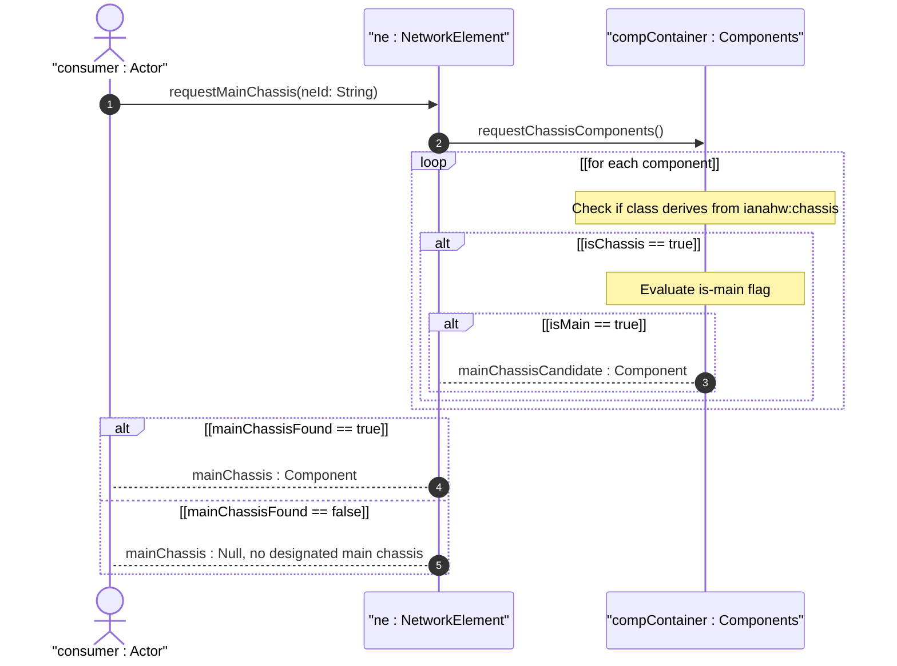

# User Story: Manage Multi-Chassis Network Elements with is-main Role Designation

## Parent Epic
- [ ] #50 - [Network Inventory: Component Inventory](https://github.com/gintatkinson/3dgs-030/blob/main/docs/epics/epic-05-component-inventory.md) (the is-main boolean leaf on chassis components enables multi-chassis NE topologies within the component model)

## Domain Object Mapping
- **Primary Domain Objects:** `component/is-main` (boolean leaf with when guard), `component/class` (mandatory union identityref), `ianahw:chassis` (hardware class identity), `component-id` (key leaf)
- **Actor/Role:** Inventory Consumer (network operator or northbound system identifying the primary chassis in multi-chassis network elements)

## BDD Scenario (OOA/OOD Realization)
**As a** Inventory Consumer
**I want to** designate and query the main chassis within a multi-chassis network element
**So that** I can identify the primary chassis among multiple chassis in the same NE for management and operational purposes

**Given** a network element "ne-001" contains two chassis components "chassis-main" and "chassis-secondary"
**When** the Inventory Consumer inspects "chassis-main" with `class` derived from `ianahw:chassis` and `is-main` set to `true`
**Then** "chassis-main" is identified as the primary chassis of the network element
**And** the `is-main` field is valid only because `derived-from-or-self(class, 'ianahw:chassis')` evaluates to true
**Given** a component "chassis-secondary" also has class derived from `ianahw:chassis`
**When** its `is-main` is set to `false` or omitted
**Then** it is recognized as a secondary chassis
**Given** a non-chassis component "port-01" with class `ianahw:port`
**When** the `is-main` field is attempted to be instantiated
**Then** the XPath when guard `derived-from-or-self(class, 'ianahw:chassis')` evaluates to false
**And** `is-main` is not instantiated for non-chassis components

## Compliance Verification Table

| Rule | Status |
|------|--------|
| Lifeline aliasing (name : Classifier) | PASS |
| Open return arrows (`-->`) used | PASS |
| Return value assignment signatures | PASS |
| Given-When-Then BDD scenarios present | PASS |
| Mermaid blocks properly closed | PASS |
| No semicolons in Note statements | PASS |
| Combined fragment guards in square brackets | PASS |
| Helper/Calculator delegation for computations | PASS |

## UML Sequence Diagram


## Operational Context
From draft-ietf-ivy-network-inventory-yang, Appendix E (Example of multi-chassis network elements):

> This appendix provides a JSON example of a multi-chassis network element where multiple chassis components exist within the same NE and the is-main flag distinguishes the primary chassis.

From the YANG module schema:
- `leaf is-main`: when `derived-from-or-self(../nwi:class, 'ianahw:chassis')`; type `boolean`; description "Main chassis indicator for multi-chassis NEs."

## Required Features Matrix
- [ ] #47 - [Network Elements Management](https://github.com/gintatkinson/3dgs-030/blob/main/docs/features/feat-12-network-elements-management.md) (the network element container that hosts all chassis components within a single NE identity)
- [ ] #48 - [Component Inventory](https://github.com/gintatkinson/3dgs-030/blob/main/docs/features/feat-13-component-inventory.md) (the is-main boolean on chassis components, guarded by the when condition requiring class derived from ianahw:chassis)

## Source References
Structural Schema: [ietf-network-inventory@2026-05-27.yang](https://github.com/gintatkinson/3dgs-030/blob/main/schema/ietf-network-inventory%402026-05-27.yang) (Clause: leaf is-main with when derived-from-or-self guard)
Normative Specification: [draft-ietf-ivy-network-inventory-yang-18](https://datatracker.ietf.org/doc/html/draft-ietf-ivy-network-inventory-yang) (Clause: Section 3.3.1, Appendix E)

> [!WARNING]
> **Mermaid Block Closing Constraints & Code Fence Integrity:**
> - Every Mermaid diagram MUST be strictly closed with ``` on a new line. Leaking Mermaid blocks or stray/unclosed code fences will fail downstream validation checks.
> - **Semicolon Restriction**: Do NOT use semicolons (`;`) in sequence diagram `Note` statements or message text statements. Semicolons are not allowed. Replace any semicolons with commas, dashes, or spaces.
