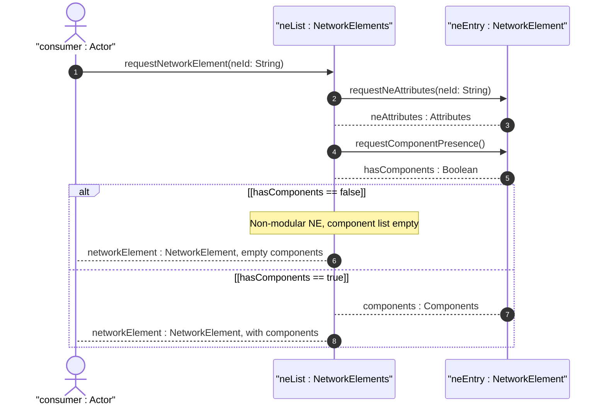

# User Story: Inventory Non-Modular Network Elements Without Component Breakdown

## Parent Epic
- [ ] #49 - [Network Inventory: Network Elements Management](https://github.com/gintatkinson/3dgs-030/blob/main/docs/epics/epic-04-network-elements-management.md) (non-modular NEs are network elements that exist without a components subtree, relying solely on the NE-level attributes)

## Domain Object Mapping
- **Primary Domain Objects:** `network-element` (list entry, config false), `ne-id` (key leaf), `ne-type` (identityref defaulting to ne-physical), `ne-component-common-entity-attributes` (grouping), `components` (container — may be present but contain an empty list)
- **Actor/Role:** Inventory Consumer (network operator or inventory system managing network elements that have no modular internal component decomposition)

## BDD Scenario (OOA/OOD Realization)
**As a** Inventory Consumer
**I want to** retrieve inventory data for network elements that have no internal component breakdown
**So that** I can manage simple or legacy devices that do not report modular hardware components but still need to be tracked in the network inventory

**Given** a non-modular network element "ne-simple" is discovered by the controller
**When** the Inventory Consumer retrieves the NE entry for "ne-simple"
**Then** the NE has a valid `ne-id`, `ne-type` (defaulting to `nwi:ne-physical`), and manufacturer metadata
**And** the `components` container may be present with an empty `component` list
**And** the lack of components does not prevent the NE from being inventoried
**Given** a modular network element "ne-modular" with a chassis and ports
**When** the inventory is retrieved
**Then** the `component` list contains entries for the chassis and port components
**And** the system handles both modular and non-modular NEs within the same inventory model

## Compliance Verification Table

| Rule | Status |
|------|--------|
| Lifeline aliasing (name : Classifier) | PASS |
| Open return arrows (`-->`) used | PASS |
| Return value assignment signatures | PASS |
| Given-When-Then BDD scenarios present | PASS |
| Mermaid blocks properly closed | PASS |
| No semicolons in Note statements | PASS |
| Combined fragment guards in square brackets | PASS |
| Helper/Calculator delegation for computations | PASS |

## UML Sequence Diagram


## Operational Context
From draft-ietf-ivy-network-inventory-yang, Appendix F (Example of non-modular network elements):

> This appendix provides a JSON example of non-modular network elements where the network element has no chassis or internal hardware component decomposition. The components container may be omitted or contain an empty list.

From draft-ietf-ivy-network-inventory-yang, Section 3:

> The network element definition is generalized to support physical network elements and other types of components' groups that can be managed as physical network elements from an inventory perspective.

From the YANG module schema:
- `container components` is a child of each `network-element`; the `component` list may contain zero entries.

## Required Features Matrix
- [ ] #46 - [Network Inventory Container](https://github.com/gintatkinson/3dgs-030/blob/main/docs/features/feat-11-network-inventory-container.md) (the root config-false container that serves as the top-level entry point, supporting NEs with or without components)
- [ ] #47 - [Network Elements Management](https://github.com/gintatkinson/3dgs-030/blob/main/docs/features/feat-12-network-elements-management.md) (the network-element list with ne-id key provides the NE identity and attributes independent of component presence, ensuring non-modular NEs are fully supported)

## Source References
Structural Schema: [ietf-network-inventory@2026-05-27.yang](https://github.com/gintatkinson/3dgs-030/blob/main/schema/ietf-network-inventory%402026-05-27.yang) (Clause: container components nested under network-element, component list with config false)
Normative Specification: [draft-ietf-ivy-network-inventory-yang-18](https://datatracker.ietf.org/doc/html/draft-ietf-ivy-network-inventory-yang) (Clause: Section 3, Appendix F)

> [!WARNING]
> **Mermaid Block Closing Constraints & Code Fence Integrity:**
> - Every Mermaid diagram MUST be strictly closed with ``` on a new line. Leaking Mermaid blocks or stray/unclosed code fences will fail downstream validation checks.
> - **Semicolon Restriction**: Do NOT use semicolons (`;`) in sequence diagram `Note` statements or message text statements. Semicolons are not allowed. Replace any semicolons with commas, dashes, or spaces.
