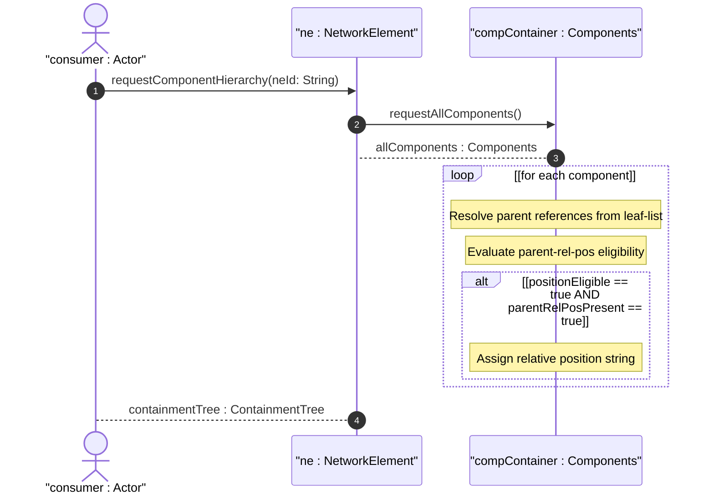

# User Story: Navigate Component Containment Hierarchy via Parent References and Relative Position

## Parent Epic
- [ ] #50 - [Network Inventory: Component Inventory](https://github.com/gintatkinson/3dgs-030/blob/main/docs/epics/epic-05-component-inventory.md) (the parent leaf-list and parent-rel-pos leaf within the component model establish hierarchical containment and sibling ordering)

## Domain Object Mapping
- **Primary Domain Objects:** `component/parent` (self-referencing leaf-list of leafref to sibling component-ids), `component/parent-rel-pos` (string leaf with when guard), `component/component-id` (key leaf), `component/class` (mandatory identityref)
- **Actor/Role:** Inventory Consumer (network operator or topology visualization system navigating the physical containment hierarchy of components within a network element)

## BDD Scenario (OOA/OOD Realization)
**As a** Inventory Consumer
**I want to** navigate the containment hierarchy of components using parent references and relative position
**So that** I can understand the physical layout and nesting of hardware components within a chassis

**Given** a network element with chassis "chassis-01", slot "slot-01" with parent ["chassis-01"], and board "board-01" with parent ["slot-01"]
**When** the Inventory Consumer retrieves the component list for this NE
**Then** the `parent` leaf-list on "slot-01" references "chassis-01"
**And** the `parent` leaf-list on "board-01" references "slot-01"
**And** "slot-01" has `parent-rel-pos` set to "1-1" indicating its position within "chassis-01"
**Given** a component has `parent` leaf-list with two entries ["chassis-01", "chassis-02"] (count >= 2)
**When** the XPath `when` condition `count(../parent) < 2` evaluates
**Then** `parent-rel-pos` is not instantiated
**And** the relative position is undefined for multi-parent components

## Compliance Verification Table

| Rule | Status |
|------|--------|
| Lifeline aliasing (name : Classifier) | PASS |
| Open return arrows (`-->`) used | PASS |
| Return value assignment signatures | PASS |
| Given-When-Then BDD scenarios present | PASS |
| Mermaid blocks properly closed | PASS |
| No semicolons in Note statements | PASS |
| Combined fragment guards in square brackets | PASS |
| Helper/Calculator delegation for computations | PASS |

## UML Sequence Diagram


## Operational Context
From draft-ietf-ivy-network-inventory-yang, Section 3.3.1:

> Figure 1 describes the relationship between typical inventory objects in a physical network element: network element 1:M chassis 1:N slot/board/sub-slot 1:N port.

From draft-ietf-ivy-network-inventory-yang, Section 3.4.3:

> There are some use cases where the parent relative position is not reported as an integer but as a string. In order to support these use cases and allowing a straightforward match between the relative position definition in the device and in the network inventory, this model is defining the 'parent-rel-pos' data node as a string instead of as an integer.

From the YANG module schema:
- `leaf-list parent`: type `leafref { path "../../component/component-id"; require-instance false; }`
- `leaf parent-rel-pos`: when `count(../parent) < 2`; type `string`

## Required Features Matrix
- [ ] #48 - [Component Inventory](https://github.com/gintatkinson/3dgs-030/blob/main/docs/features/feat-13-component-inventory.md) (the parent leaf-list and parent-rel-pos leaf are both part of the component model, enabling self-referencing containment and sibling ordering with the when guard on parent-rel-pos)

## Source References
Structural Schema: [ietf-network-inventory@2026-05-27.yang](https://github.com/gintatkinson/3dgs-030/blob/main/schema/ietf-network-inventory%402026-05-27.yang) (Clause: leaf-list parent, leaf parent-rel-pos with when guard)
Normative Specification: [draft-ietf-ivy-network-inventory-yang-18](https://datatracker.ietf.org/doc/html/draft-ietf-ivy-network-inventory-yang) (Clause: Sections 3.3.1, 3.4.3)

> [!WARNING]
> **Mermaid Block Closing Constraints & Code Fence Integrity:**
> - Every Mermaid diagram MUST be strictly closed with ``` on a new line. Leaking Mermaid blocks or stray/unclosed code fences will fail downstream validation checks.
> - **Semicolon Restriction**: Do NOT use semicolons (`;`) in sequence diagram `Note` statements or message text statements. Semicolons are not allowed. Replace any semicolons with commas, dashes, or spaces.
