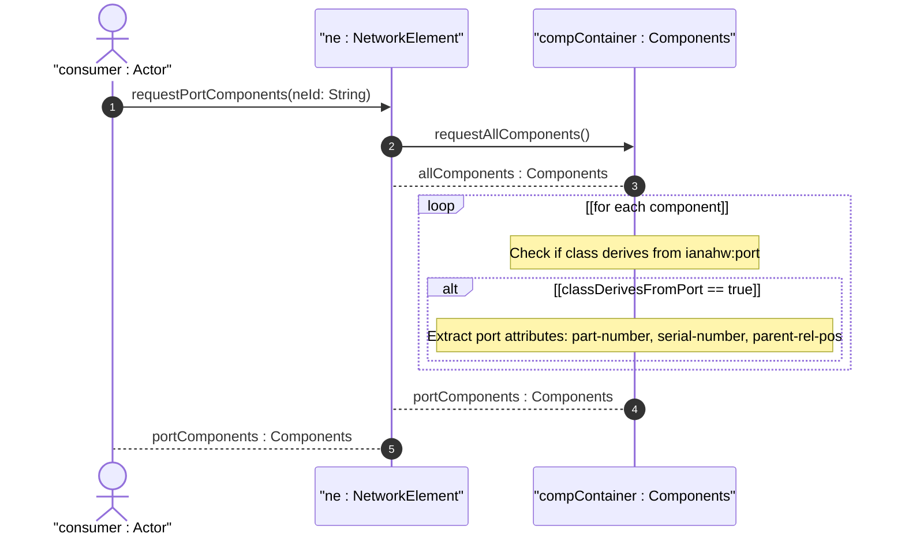

# User Story: Inventory Port Components as Transceiver and Connector Endpoints

## Parent Epic
- [ ] #50 - [Network Inventory: Component Inventory](https://github.com/gintatkinson/3dgs-030/blob/main/docs/epics/epic-05-component-inventory.md) (port components are a specialization of the component model with class ianahw:port and may be empty when no pluggable module is inserted)

## Domain Object Mapping
- **Primary Domain Objects:** `component` (list entry with class `ianahw:port`), `component/class` (mandatory identityref to ianahw:port), `component/parent` (leaf-list referencing enclosing board or chassis), `port-ref` (grouping for referencing port components), `component/parent-rel-pos` (optional string for port position within parent)
- **Actor/Role:** Inventory Consumer (network operator or port management system enumerating physical ports of a network element)

## BDD Scenario (OOA/OOD Realization)
**As a** Inventory Consumer
**I want to** retrieve port component inventory for a network element
**So that** I can identify all physical transceiver and connector endpoints where networking traffic is received or transmitted

**Given** a network element "ne-001" contains a board "board-01" with ports "port-01" and "port-02"
**When** the Inventory Consumer retrieves components with class `ianahw:port`
**Then** two port components are returned
**And** each port has `parent` referencing "board-01"
**And** each port has `parent-rel-pos` indicating its physical slot position on the board
**And** each port may have `part-number`, `serial-number`, `mfg-name`, and `product-name`
**Given** a pluggable port has no transceiver module inserted
**When** the port component is retrieved
**Then** the port component entry still exists (the port slot is present)
**And** the pluggable module attributes may be absent

## Compliance Verification Table

| Rule | Status |
|------|--------|
| Lifeline aliasing (name : Classifier) | PASS |
| Open return arrows (`-->`) used | PASS |
| Return value assignment signatures | PASS |
| Given-When-Then BDD scenarios present | PASS |
| Mermaid blocks properly closed | PASS |
| No semicolons in Note statements | PASS |
| Combined fragment guards in square brackets | PASS |
| Helper/Calculator delegation for computations | PASS |

## UML Sequence Diagram


## Operational Context
From draft-ietf-ivy-network-inventory-yang, Appendix D (Examples of ports):

> This appendix provides JSON examples illustrating how port components are represented in the inventory, including their class identity (ianahw:port), parent references to the containing board or chassis, relative position, and manufacturing metadata.

From draft-ietf-ivy-network-inventory-yang, Section 2.2 (Terminology):

> Port: A component where networking traffic can be received and/or transmitted, e.g., by attaching networking cables. In case of pluggable ports, the port may be empty when no pluggable module is plugged in.

From the YANG module schema:
- `grouping port-ref`: references a port component within a network element using ne-ref and port-ref leafrefs
- `component/class` union includes `ianahw:port` (derived from ianahw:hardware-class)

## Required Features Matrix
- [ ] #48 - [Component Inventory](https://github.com/gintatkinson/3dgs-030/blob/main/docs/features/feat-13-component-inventory.md) (port components are an instantiation of the component model with class ianahw:port, carrying the full component-attributes set including parent containment, manufacturing metadata, and FRU status)

## Source References
Structural Schema: [ietf-network-inventory@2026-05-27.yang](https://github.com/gintatkinson/3dgs-030/blob/main/schema/ietf-network-inventory%402026-05-27.yang) (Clause: grouping port-ref, list component with class identityref including ianahw:port)
Normative Specification: [draft-ietf-ivy-network-inventory-yang-18](https://datatracker.ietf.org/doc/html/draft-ietf-ivy-network-inventory-yang) (Clause: Section 2.2, Appendix D)

> [!WARNING]
> **Mermaid Block Closing Constraints & Code Fence Integrity:**
> - Every Mermaid diagram MUST be strictly closed with ``` on a new line. Leaking Mermaid blocks or stray/unclosed code fences will fail downstream validation checks.
> - **Semicolon Restriction**: Do NOT use semicolons (`;`) in sequence diagram `Note` statements or message text statements. Semicolons are not allowed. Replace any semicolons with commas, dashes, or spaces.
