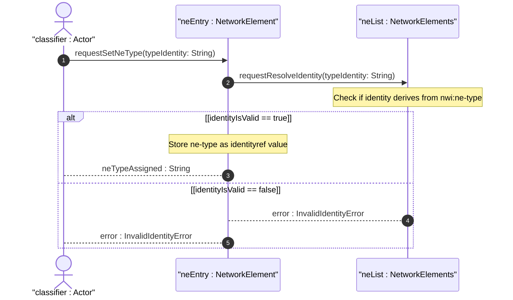

# User Story: Classify Network Element Types via Extensible Identity System

## Parent Epic
- [ ] #49 - [Network Inventory: Network Elements Management](https://github.com/gintatkinson/3dgs-030/blob/main/docs/epics/epic-04-network-elements-management.md) (the ne-type identityref with base identity ne-type and default ne-physical is defined within the NE Management bounded context)

## Domain Object Mapping
- **Primary Domain Objects:** `ne-type` (identityref leaf with base nwi:ne-type), `nwi:ne-type` (base identity), `nwi:ne-physical` (derived identity), `network-element/ne-type` (config false, default "nwi:ne-physical")
- **Actor/Role:** NE Type Classifier (system or companion augmentation module assigning and resolving NE type identities)

## BDD Scenario (OOA/OOD Realization)
**As a** NE Type Classifier
**I want to** classify network elements using the extensible `ne-type` identity system
**So that** I can differentiate physical network elements from other NE types (e.g., virtual, logical) and support future type extensions via augmentation

**Given** a network element is discovered with no explicit `ne-type` value
**When** the NE entry is retrieved from the inventory
**Then** the `ne-type` defaults to `nwi:ne-physical`
**And** the identity is resolved as derived from the base identity `nwi:ne-type`
**Given** a companion augmentation module defines a new identity `ne-virtual` with base `nwi:ne-type`
**When** a network element is classified with `ne-type` set to `augmented-mod:ne-virtual`
**Then** the identityref resolves correctly to the augmented identity
**And** the NE is recognized as a virtual network element
**Given** an invalid identity not derived from `nwi:ne-type` is provided
**When** the server validates the `ne-type` field
**Then** the value is rejected as not conforming to the identityref base constraint

## Compliance Verification Table

| Rule | Status |
|------|--------|
| Lifeline aliasing (name : Classifier) | PASS |
| Open return arrows (`-->`) used | PASS |
| Return value assignment signatures | PASS |
| Given-When-Then BDD scenarios present | PASS |
| Mermaid blocks properly closed | PASS |
| No semicolons in Note statements | PASS |
| Combined fragment guards in square brackets | PASS |
| Helper/Calculator delegation for computations | PASS |

## UML Sequence Diagram


## Operational Context
From draft-ietf-ivy-network-inventory-yang, Section 3:

> The "ne-type" is defined as a YANG identity to describe the type of the network element. This document defines only the "physical-network-element" identity. Other types of network elements can be defined in other documents, together with the associated YANG identity and the rationale for managing them as network elements from an inventory perspective.

From draft-ietf-ivy-network-inventory-yang, Section 3.2:

> ne-type: The type of network element (e.g., physical network element). See Section 3 for the definition of NE types.

From the YANG module schema:
- `identity ne-type`: base identity for network element types
- `identity ne-physical`: base `nwi:ne-type`
- `leaf ne-type`: type `identityref { base nwi:ne-type; }`, default "nwi:ne-physical"

## Required Features Matrix
- [ ] #47 - [Network Elements Management](https://github.com/gintatkinson/3dgs-030/blob/main/docs/features/feat-12-network-elements-management.md) (the ne-type leaf with identityref base nwi:ne-type, the ne-type base identity, and the ne-physical derived identity are all defined within this feature's bounded context)

## Source References
Structural Schema: [ietf-network-inventory@2026-05-27.yang](https://github.com/gintatkinson/3dgs-030/blob/main/schema/ietf-network-inventory%402026-05-27.yang) (Clause: identity ne-type, identity ne-physical, leaf ne-type with identityref)
Normative Specification: [draft-ietf-ivy-network-inventory-yang-18](https://datatracker.ietf.org/doc/html/draft-ietf-ivy-network-inventory-yang) (Clause: Sections 3, 3.2)

> [!WARNING]
> **Mermaid Block Closing Constraints & Code Fence Integrity:**
> - Every Mermaid diagram MUST be strictly closed with ``` on a new line. Leaking Mermaid blocks or stray/unclosed code fences will fail downstream validation checks.
> - **Semicolon Restriction**: Do NOT use semicolons (`;`) in sequence diagram `Note` statements or message text statements. Semicolons are not allowed. Replace any semicolons with commas, dashes, or spaces.
