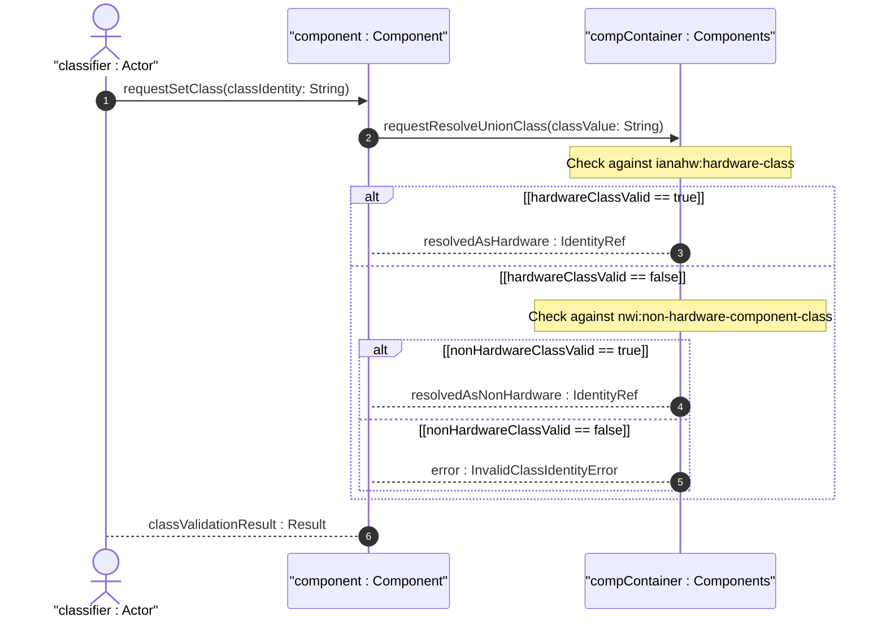

# User Story: Classify Hardware and Non-Hardware Component Types via Union Identityref

## Parent Epic
- [ ] #50 - [Network Inventory: Component Inventory](https://github.com/gintatkinson/3dgs-030/blob/main/docs/epics/epic-05-component-inventory.md) (the mandatory class union of ianahw:hardware-class and nwi:non-hardware-component-class is the core typing mechanism for the component model)

## Domain Object Mapping
- **Primary Domain Objects:** `component/class` (mandatory union identityref leaf), `ianahw:hardware-class` (IANA hardware identity base), `nwi:non-hardware-component-class` (base identity for software and non-hardware components), `component-attributes` (grouping)
- **Actor/Role:** Component Classifier (system or augmentation module resolving and validating the class union of hardware and non-hardware component types)

## BDD Scenario (OOA/OOD Realization)
**As a** Component Classifier
**I want to** classify components as hardware or non-hardware types using the union identityref system
**So that** I can distinguish physical hardware (chassis, slot, board, port, CPU, fan, power supply) from non-hardware inventory objects (software licenses, virtual functions) within the same component list

**Given** a component "chassis-01" is being inventoried
**When** the `class` is set to `ianahw:chassis` (derived from `ianahw:hardware-class`)
**Then** the identityref resolves against the `ianahw:hardware-class` base of the union
**And** the component is classified as a physical chassis
**Given** a companion augmentation module defines `sw-license` derived from `nwi:non-hardware-component-class`
**When** a component is classified with `class` set to `augmented-mod:sw-license`
**Then** the identityref resolves against the `nwi:non-hardware-component-class` union member
**And** the component is classified as a non-hardware software license
**Given** a component `class` value is neither a valid hardware class nor a valid non-hardware identity
**When** the server validates the component schema
**Then** the value is rejected because the mandatory class field does not conform to the union type

## Compliance Verification Table

| Rule | Status |
|------|--------|
| Lifeline aliasing (name : Classifier) | PASS |
| Open return arrows (`-->`) used | PASS |
| Return value assignment signatures | PASS |
| Given-When-Then BDD scenarios present | PASS |
| Mermaid blocks properly closed | PASS |
| No semicolons in Note statements | PASS |
| Combined fragment guards in square brackets | PASS |
| Helper/Calculator delegation for computations | PASS |

## UML Sequence Diagram


## Operational Context
From draft-ietf-ivy-network-inventory-yang, Section 3:

> The component definition is also generalized to support any types of component inventory objects that can be managed as hardware components from an inventory perspective. Different types of components can be distinguished by the class of component. The component "class" is defined as a union between the hardware class identity, defined in "iana-hardware", and the "non-hardware" identity, defined in this document. The identity definition of additional types of "ne-type" and "non-hardware" identity of component are outside the scope of this document and could be defined in application- and technology-specific companion augmentation data models.

From draft-ietf-ivy-network-inventory-yang, Section 3.3:

> class: The type of component (e.g., chassis, module, port). See Section 3 for the definition of component types.

From the YANG module schema:
- `leaf class`: type `union { type identityref { base ianahw:hardware-class; } type identityref { base nwi:non-hardware-component-class; } }`, mandatory true
- `identity non-hardware-component-class`: base identity for non-hardware components
- `grouping component-attributes`: includes the mandatory class leaf

## Required Features Matrix
- [ ] #48 - [Component Inventory](https://github.com/gintatkinson/3dgs-030/blob/main/docs/features/feat-13-component-inventory.md) (the mandatory class union is the core constraint of the component model, with the non-hardware-component-class identity and the component-attributes grouping both defined in this bounded context)

## Source References
Structural Schema: [ietf-network-inventory@2026-05-27.yang](https://github.com/gintatkinson/3dgs-030/blob/main/schema/ietf-network-inventory%402026-05-27.yang) (Clause: identity non-hardware-component-class, leaf class with union type, grouping component-attributes)
Normative Specification: [draft-ietf-ivy-network-inventory-yang-18](https://datatracker.ietf.org/doc/html/draft-ietf-ivy-network-inventory-yang) (Clause: Sections 3, 3.3)

> [!WARNING]
> **Mermaid Block Closing Constraints & Code Fence Integrity:**
> - Every Mermaid diagram MUST be strictly closed with ``` on a new line. Leaking Mermaid blocks or stray/unclosed code fences will fail downstream validation checks.
> - **Semicolon Restriction**: Do NOT use semicolons (`;`) in sequence diagram `Note` statements or message text statements. Semicolons are not allowed. Replace any semicolons with commas, dashes, or spaces.
