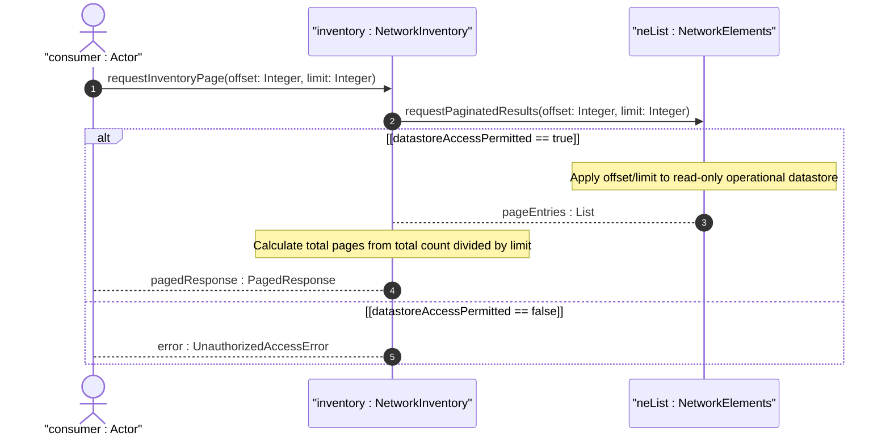

# User Story: Access Read-Only Operational Inventory with Pagination Support

## Parent Epic
- [ ] #49 - [Network Inventory: Network Elements Management](https://github.com/gintatkinson/3dgs-030/blob/main/docs/epics/epic-04-network-elements-management.md) (the config false operational state and pagination considerations for large NE lists and component lists are governed at the inventory-wide scope)

## Domain Object Mapping
- **Primary Domain Objects:** `network-inventory` (config false root container), `network-elements/network-element` (list with config false), `components/component` (nested list with config false), `ne-id` (key leaf), `component-id` (key leaf)
- **Actor/Role:** Inventory Consumer (northbound application or OSS system requesting paginated inventory data from the controller's read-only operational datastore)

## BDD Scenario (OOA/OOD Realization)
**As a** Inventory Consumer
**I want to** retrieve network inventory data from the read-only operational datastore with efficient pagination
**So that** I can handle large inventories with hundreds of NEs and thousands of components without overwhelming the transport or system memory

**Given** a network controller manages a read-only inventory with 500 network elements
**When** the Inventory Consumer fetches inventory with offset 0 and limit 50
**Then** only the first 50 network elements are returned
**And** subsequent pages can be requested by incrementing the offset
**Given** a network element "ne-001" has 200 components
**When** the Inventory Consumer fetches components for "ne-001" with limit 50
**Then** only the first 50 components are returned
**And** the consumer can iterate through pages to retrieve all components
**Given** any inventory data node is part of the `config false` operational datastore
**When** a client attempts a write, create, or delete operation
**Then** the server rejects the operation
**And** returns an error indicating the datastore is read-only

## Compliance Verification Table

| Rule | Status |
|------|--------|
| Lifeline aliasing (name : Classifier) | PASS |
| Open return arrows (`-->`) used | PASS |
| Return value assignment signatures | PASS |
| Given-When-Then BDD scenarios present | PASS |
| Mermaid blocks properly closed | PASS |
| No semicolons in Note statements | PASS |
| Combined fragment guards in square brackets | PASS |
| Helper/Calculator delegation for computations | PASS |

## UML Sequence Diagram


## Operational Context
From draft-ietf-ivy-network-inventory-yang, Section 6 (Operational Considerations):

> The network inventory provides a read-only perspective of the actual inventory data that a network controller knows of what it is actually installed within the network. Therefore, other inventory data (e.g., spare or inactive assets) are outside the scope of this model. The distinction between a temporarily unreachable network element and one that has been removed from the network is outside the scope of this document and depends on the discovery mechanism used by the controller.

From draft-ietf-ivy-network-inventory-yang, Appendix C (Efficiency Issue):

> This appendix discusses efficiency considerations when retrieving large inventories, including the need for pagination support at the protocol or application level.

From the YANG module schema:
- `container network-inventory`: config false; description "Top-level container for network inventory."
- All descending nodes are config false (read-only operational state)

## Required Features Matrix
- [ ] #46 - [Network Inventory Container](https://github.com/gintatkinson/3dgs-030/blob/main/docs/features/feat-11-network-inventory-container.md) (the root config-false container defines the read-only operational datastore boundary for all inventory data, establishing the scope within which pagination is applied)
- [ ] #47 - [Network Elements Management](https://github.com/gintatkinson/3dgs-030/blob/main/docs/features/feat-12-network-elements-management.md) (the NE list pagination operates over the network-element list keyed by ne-id)
- [ ] #48 - [Component Inventory](https://github.com/gintatkinson/3dgs-030/blob/main/docs/features/feat-13-component-inventory.md) (the component list pagination operates over the component list keyed by component-id within each NE)

## Source References
Structural Schema: [ietf-network-inventory@2026-05-27.yang](https://github.com/gintatkinson/3dgs-030/blob/main/schema/ietf-network-inventory%402026-05-27.yang) (Clause: container network-inventory config false, all list/leaf children are config false)
Normative Specification: [draft-ietf-ivy-network-inventory-yang-18](https://datatracker.ietf.org/doc/html/draft-ietf-ivy-network-inventory-yang) (Clause: Section 6, Appendix C)

> [!WARNING]
> **Mermaid Block Closing Constraints & Code Fence Integrity:**
> - Every Mermaid diagram MUST be strictly closed with ``` on a new line. Leaking Mermaid blocks or stray/unclosed code fences will fail downstream validation checks.
> - **Semicolon Restriction**: Do NOT use semicolons (`;`) in sequence diagram `Note` statements or message text statements. Semicolons are not allowed. Replace any semicolons with commas, dashes, or spaces.
