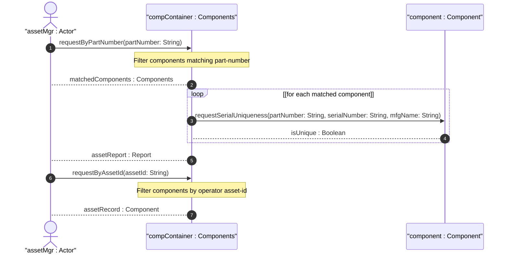

# User Story: Track Part and Serial Numbers for Asset Management

## Parent Epic
- [ ] #50 - [Network Inventory: Component Inventory](https://github.com/gintatkinson/3dgs-030/blob/main/docs/epics/epic-05-component-inventory.md) (part-number and serial-number are core component-attributes defined in the component model, with the part-number replacing RFC 8348 model-name)

## Domain Object Mapping
- **Primary Domain Objects:** `component/part-number` (string leaf), `component/serial-number` (string leaf), `component/asset-id` (string leaf), `component/mfg-name` (string leaf), `component-attributes` (grouping), `component/component-id` (key leaf)
- **Actor/Role:** Asset Manager (network operator, procurement system, or asset tracking database correlating inventory components with vendor part numbers and instance serial numbers)

## BDD Scenario (OOA/OOD Realization)
**As a** Asset Manager
**I want to** track vendor part numbers and serial numbers for each component in the inventory
**So that** I can correlate inventory items with procurement records, warranty claims, and vendor support contracts

**Given** a component "chassis-01" manufactured by "VendorCorp"
**When** the Asset Manager retrieves the component attributes
**Then** `part-number` is "PN-CH3000-V2" representing the vendor-assigned type identifier
**And** `serial-number` is "SN-CH3000-00001" uniquely identifying the instance within the part-number scope
**And** `mfg-name` is "VendorCorp" providing the manufacturer context
**Given** a component "power-supply-01" has `part-number` "PN-PS500" and `serial-number` "SN-PS500-00042"
**When** the Asset Manager queries components by part-number "PN-PS500"
**Then** all instances of that power supply model are returned
**And** each instance is distinguishable by its unique serial number
**Given** a component has an operator-specified tracking identifier
**When** `asset-id` is set to "ASSET-5001"
**Then** the operator can cross-reference the component with their internal asset management system

## Compliance Verification Table

| Rule | Status |
|------|--------|
| Lifeline aliasing (name : Classifier) | PASS |
| Open return arrows (`-->`) used | PASS |
| Return value assignment signatures | PASS |
| Given-When-Then BDD scenarios present | PASS |
| Mermaid blocks properly closed | PASS |
| No semicolons in Note statements | PASS |
| Combined fragment guards in square brackets | PASS |
| Helper/Calculator delegation for computations | PASS |

## UML Sequence Diagram


## Operational Context
From draft-ietf-ivy-network-inventory-yang, Section 3.3:

> part-number: The vendor-specific part number of the component type. It is expected that vendors assign unique part numbers to different component types within the scope of the vendor. Although the part number is often an alphanumeric string and not a number, this document uses this term since it is widely used and well known in the industry.

> serial-number: The vendor-specific serial number of the component instance. It is expected that vendors assign unique serial numbers to different component instances at least within the scope of the part-number. Although the serial number is often an alphanumeric string and not a number, this document uses this term since it is widely used and well known in the industry.

> asset-id: An asset tracking identifier for the component, provided by a network operator.

From draft-ietf-ivy-network-inventory-yang, Section 3.4.1:

> According to the description in RFC 8348, the attribute named "model-name" under the component, is preferred to have a customer-visible part number value. "Model-name" is not straightforward to understand, and therefore, in this model the attribute is called "part-number".

## Required Features Matrix
- [ ] #48 - [Component Inventory](https://github.com/gintatkinson/3dgs-030/blob/main/docs/features/feat-13-component-inventory.md) (the part-number, serial-number, and asset-id leaves are defined within component-attributes, providing the full asset tracking suite for each component)

## Source References
Structural Schema: [ietf-network-inventory@2026-05-27.yang](https://github.com/gintatkinson/3dgs-030/blob/main/schema/ietf-network-inventory%402026-05-27.yang) (Clause: leaf part-number, leaf serial-number, leaf asset-id within component-attributes grouping)
Normative Specification: [draft-ietf-ivy-network-inventory-yang-18](https://datatracker.ietf.org/doc/html/draft-ietf-ivy-network-inventory-yang) (Clause: Sections 3.3, 3.4, 3.4.1)

> [!WARNING]
> **Mermaid Block Closing Constraints & Code Fence Integrity:**
> - Every Mermaid diagram MUST be strictly closed with ``` on a new line. Leaking Mermaid blocks or stray/unclosed code fences will fail downstream validation checks.
> - **Semicolon Restriction**: Do NOT use semicolons (`;`) in sequence diagram `Note` statements or message text statements. Semicolons are not allowed. Replace any semicolons with commas, dashes, or spaces.
