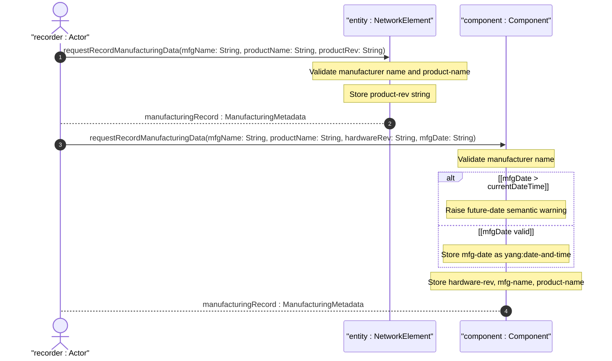

# User Story: Record Manufacturing and Revision Data for Inventory Entities

## Parent Epic
- [ ] #49 - [Network Inventory: Network Elements Management](https://github.com/gintatkinson/3dgs-030/blob/main/docs/epics/epic-04-network-elements-management.md) (product-rev on NEs and manufacturer name shared via ne-component-common-entity-attributes)
- [ ] #50 - [Network Inventory: Component Inventory](https://github.com/gintatkinson/3dgs-030/blob/main/docs/epics/epic-05-component-inventory.md) (hardware-rev, mfg-name, product-name are component-attributes for detailed manufacturing metadata)

## Domain Object Mapping
- **Primary Domain Objects:** `component/hardware-rev` (string leaf), `component/mfg-name` (string leaf), `component/product-name` (string leaf), `component/mfg-date` (yang:date-and-time leaf), `network-element/product-rev` (string leaf), `ne-component-common-entity-attributes` (grouping), `component-attributes` (grouping)
- **Actor/Role:** Manufacturing Data Recorder (system or operator recording hardware revision identifiers and manufacturer details for traceability and compliance)

## BDD Scenario (OOA/OOD Realization)
**As a** Manufacturing Data Recorder
**I want to** record manufacturing metadata including manufacturer name, product name, hardware revision, and manufacturing date for inventory entities
**So that** I can trace components to their vendor, verify hardware revision compliance, and support warranty and lifecycle management

**Given** a component "chassis-01" is manufactured by "VendorCorp" as product "CH-3000"
**When** the inventory data is retrieved
**Then** `mfg-name` is "VendorCorp" identifying the manufacturer
**And** `product-name` is "CH-3000" identifying the vendor-specific product type
**And** `hardware-rev` is "rev-C" representing the hardware revision printed on the component
**And** `mfg-date` is "2025-03-15T08:00:00Z" as an ISO 8601 date-and-time
**Given** a network element has product revision "rev-B"
**When** the NE entry is retrieved
**Then** `product-rev` is "rev-B" representing the vendor-specific product revision string
**Given** a component's `mfg-date` is later than the current date
**When** the manufacturing data is ingested
**Then** a validation warning is raised because a future manufacturing date is semantically anomalous
**And** the value is not schema-invalid but may indicate data quality issues

## Compliance Verification Table

| Rule | Status |
|------|--------|
| Lifeline aliasing (name : Classifier) | PASS |
| Open return arrows (`-->`) used | PASS |
| Return value assignment signatures | PASS |
| Given-When-Then BDD scenarios present | PASS |
| Mermaid blocks properly closed | PASS |
| No semicolons in Note statements | PASS |
| Combined fragment guards in square brackets | PASS |
| Helper/Calculator delegation for computations | PASS |

## UML Sequence Diagram


## Operational Context
From draft-ietf-ivy-network-inventory-yang, Section 3.3:

> hardware-rev: The vendor-specific hardware revision string for the component. The preferred value is the hardware revision identifier actually printed on the component itself (if present).

> mfg-date: The date of manufacturing of the component.

From draft-ietf-ivy-network-inventory-yang, Section 3.1.1:

> mfg-name: The name of the manufacturer of the entity (component or network element). product-name: The vendor-specific and human-interpretable string describing the entity (component or network element) type. It is expected that vendors assign unique product names to different entities within the scope of the vendor.

From draft-ietf-ivy-network-inventory-yang, Section 3.2:

> product-rev: A vendor-specific product revision string for the network-element.

From the YANG module schema:
- `leaf hardware-rev`: type `string`, within `component-attributes`
- `leaf mfg-date`: type `yang:date-and-time`, within `component-attributes`
- `leaf product-rev`: type `string`, within `network-element`

## Required Features Matrix
- [ ] #47 - [Network Elements Management](https://github.com/gintatkinson/3dgs-030/blob/main/docs/features/feat-12-network-elements-management.md) (manufacturer name, product name, and product-rev are part of the NE attributes, inherited from ne-component-common-entity-attributes)
- [ ] #48 - [Component Inventory](https://github.com/gintatkinson/3dgs-030/blob/main/docs/features/feat-13-component-inventory.md) (hardware-rev, mfg-date, mfg-name, and product-name are all core component-attributes providing detailed manufacturing metadata for each component)

## Source References
Structural Schema: [ietf-network-inventory@2026-05-27.yang](https://github.com/gintatkinson/3dgs-030/blob/main/schema/ietf-network-inventory%402026-05-27.yang) (Clause: leaf product-rev in network-element, leaf hardware-rev and leaf mfg-date in component-attributes, grouping ne-component-common-entity-attributes with mfg-name and product-name)
Normative Specification: [draft-ietf-ivy-network-inventory-yang-18](https://datatracker.ietf.org/doc/html/draft-ietf-ivy-network-inventory-yang) (Clause: Sections 3.1.1, 3.2, 3.3)

> [!WARNING]
> **Mermaid Block Closing Constraints & Code Fence Integrity:**
> - Every Mermaid diagram MUST be strictly closed with ``` on a new line. Leaking Mermaid blocks or stray/unclosed code fences will fail downstream validation checks.
> - **Semicolon Restriction**: Do NOT use semicolons (`;`) in sequence diagram `Note` statements or message text statements. Semicolons are not allowed. Replace any semicolons with commas, dashes, or spaces.
