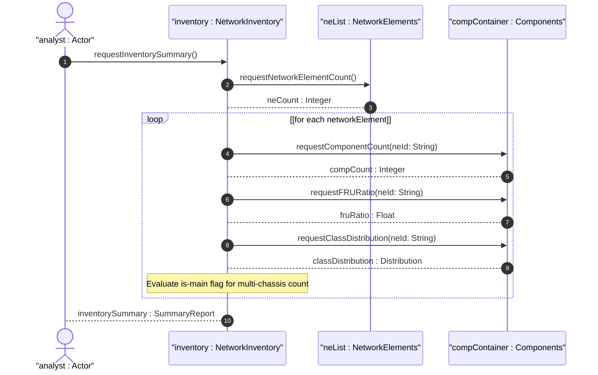

# User Story: Compute Inventory Summaries and Entity Counts Across the Network

## Parent Epic
- [ ] #49 - [Network Inventory: Network Elements Management](https://github.com/gintatkinson/3dgs-030/blob/main/docs/epics/epic-04-network-elements-management.md) (NE count is a derived metric computed over the network-element list)
- [ ] #50 - [Network Inventory: Component Inventory](https://github.com/gintatkinson/3dgs-030/blob/main/docs/epics/epic-05-component-inventory.md) (component counts, class distribution, and FRU ratios are derived from the component list)

## Domain Object Mapping
- **Primary Domain Objects:** `network-element` (list), `component` (list), `component/class` (identityref leaf), `component/is-fru` (boolean leaf), `component/is-main` (boolean leaf), `ne-type` (identityref leaf), `network-elements` (container)
- **Actor/Role:** Inventory Analyst (operator or dashboard system requesting computed inventory summaries including total counts, class distributions, FRU ratios, and multi-chassis indicators)

## BDD Scenario (OOA/OOD Realization)
**As a** Inventory Analyst
**I want to** compute aggregate inventory summaries including total NE count, total component count per NE, component class distribution, FRU ratio, and multi-chassis NE count
**So that** I can monitor network scale, identify hardware diversity, assess serviceability, and generate capacity reports

**Given** the network inventory contains 50 network elements across the controller domain
**When** the Inventory Analyst requests a network inventory summary
**Then** the total NE count is 50
**And** the count is derived by enumerating all entries in the `network-element` list
**Given** an NE "ne-001" has 15 components of which 3 are chassis (ianahw:chassis), 5 are ports (ianahw:port), and 4 are FRU
**When** the Inventory Analyst requests component summary for "ne-001"
**Then** total component count is 15
**And** the class distribution shows: chassis=3, port=5, other=7
**And** the FRU ratio is 4/15 (approx 26.7%)
**And** multi-chassis count is derived from components where `is-main` is true
**Given** an NE has zero components (non-modular NE)
**When** the summary is computed
**Then** total component count is 0
**And** the NE is not omitted from the aggregate NE count

## Compliance Verification Table

| Rule | Status |
|------|--------|
| Lifeline aliasing (name : Classifier) | PASS |
| Open return arrows (`-->`) used | PASS |
| Return value assignment signatures | PASS |
| Given-When-Then BDD scenarios present | PASS |
| Mermaid blocks properly closed | PASS |
| No semicolons in Note statements | PASS |
| Combined fragment guards in square brackets | PASS |
| Helper/Calculator delegation for computations | PASS |

## UML Sequence Diagram


## Operational Context
From the Network Inventory tree diagram (Section 4):

> The network-inventory container hosts network-elements with a list of network-element entries, each containing a components container with a list of component entries.

Derived computational requirements:
- `neCount = count(/network-inventory/network-elements/network-element)` — total NEs in the controller domain
- `totalComponentCount = sum over all NEs of count(components/component)` — total components network-wide
- `compCountPerNE(neId) = count(/network-inventory/network-elements/network-element[ne-id='neId']/components/component)` — components per specific NE
- `classDistribution = group by component/class identityref` — component type distribution
- `fruRatio(neId) = count(component[is-fru='true']) / count(component)` — field-replaceable unit ratio per NE
- `multiChassisNECount = count(network-element[components/component[is-main='true']])` — multi-chassis NE count

## Required Features Matrix
- [ ] #46 - [Network Inventory Container](https://github.com/gintatkinson/3dgs-030/blob/main/docs/features/feat-11-network-inventory-container.md) (the root container over which the aggregate NE count is computed, serving as the single traversal entry point)
- [ ] #47 - [Network Elements Management](https://github.com/gintatkinson/3dgs-030/blob/main/docs/features/feat-12-network-elements-management.md) (the NE list enumeration underpins the neCount and multi-chassis NE count calculations)
- [ ] #48 - [Component Inventory](https://github.com/gintatkinson/3dgs-030/blob/main/docs/features/feat-13-component-inventory.md) (component counts, class distributions, and FRU ratios are all derived from the component list within each NE)

## Source References
Structural Schema: [ietf-network-inventory@2026-05-27.yang](https://github.com/gintatkinson/3dgs-030/blob/main/schema/ietf-network-inventory%402026-05-27.yang) (Clause: container network-inventory, list network-element, list component with class, is-fru, and is-main leaves)
Normative Specification: [draft-ietf-ivy-network-inventory-yang-18](https://datatracker.ietf.org/doc/html/draft-ietf-ivy-network-inventory-yang) (Clause: Sections 3, 3.2, 3.3, 4)

> [!WARNING]
> **Mermaid Block Closing Constraints & Code Fence Integrity:**
> - Every Mermaid diagram MUST be strictly closed with ``` on a new line. Leaking Mermaid blocks or stray/unclosed code fences will fail downstream validation checks.
> - **Semicolon Restriction**: Do NOT use semicolons (`;`) in sequence diagram `Note` statements or message text statements. Semicolons are not allowed. Replace any semicolons with commas, dashes, or spaces.
