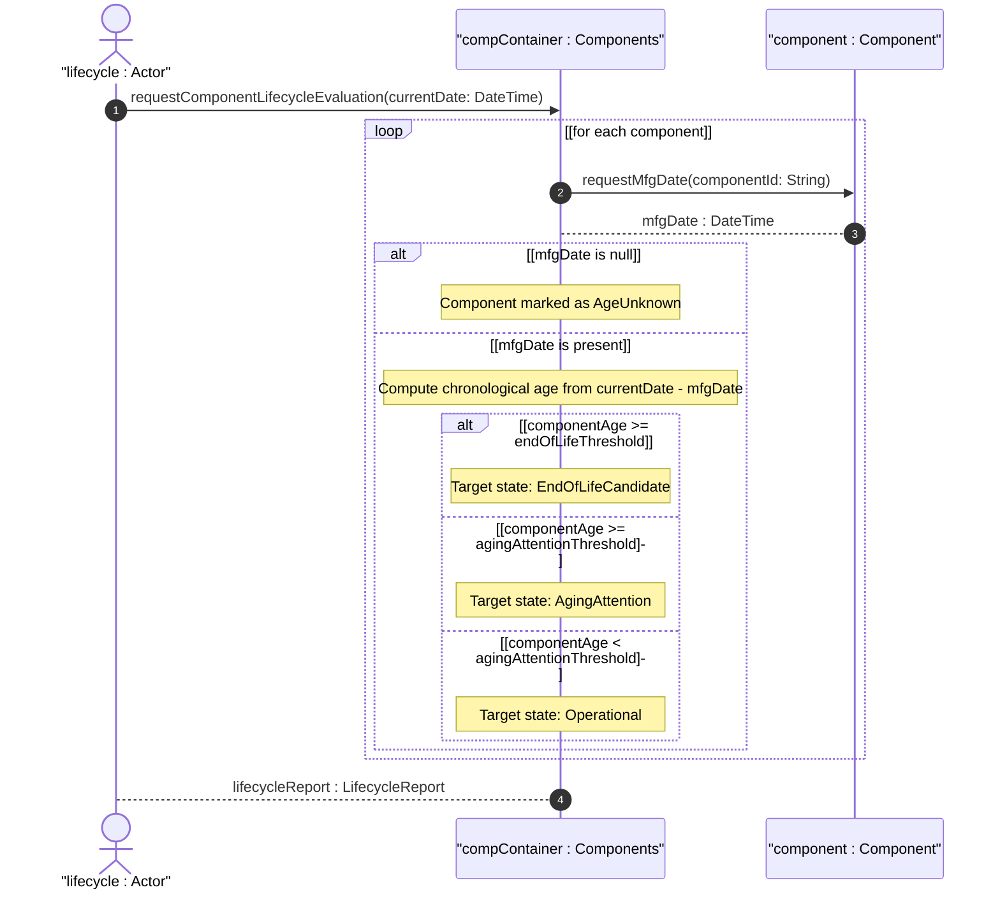
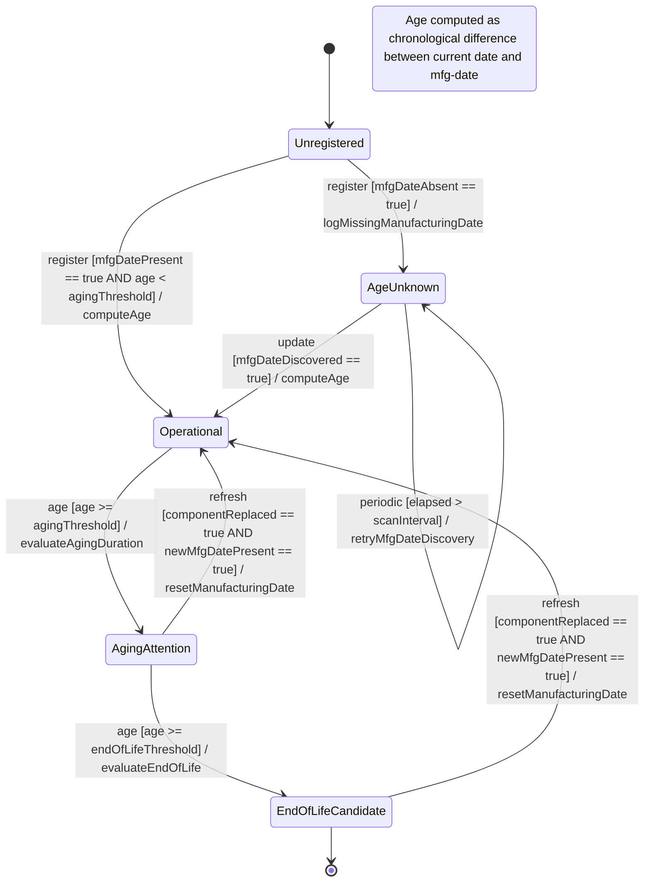

# User Story: Track Component Age from Manufacturing Date for Lifecycle Management

## Parent Epic
- [ ] #50 - [Network Inventory: Component Inventory](https://github.com/gintatkinson/3dgs-030/blob/main/docs/epics/epic-05-component-inventory.md) (the mfg-date yang:date-and-time leaf within component-attributes is the source for component age tracking)

## Domain Object Mapping
- **Primary Domain Objects:** `component/mfg-date` (yang:date-and-time leaf), `component/component-id` (key leaf), `component/is-fru` (boolean leaf), `component/hardware-rev` (string leaf), `component-attributes` (grouping), `component/part-number` (string leaf)
- **Actor/Role:** Lifecycle Manager (system or operator tracking component age, identifying aging hardware approaching end-of-life, and planning refresh cycles based on manufacturing date)

## BDD Scenario (OOA/OOD Realization)
**As a** Lifecycle Manager
**I want to** compute the age of each component from its manufacturing date and identify components exceeding operational age thresholds
**So that** I can proactively plan hardware refresh cycles, identify aging assets, and manage warranty expiration

**Given** the current date is 2026-07-30 and a component "chassis-01" has `mfg-date` "2021-07-30T00:00:00Z"
**When** the Lifecycle Manager computes component age
**Then** the age of "chassis-01" is exactly 5 years
**And** the component transitions from `Operational` state to `AgingAttention` state if a 5-year threshold is configured
**Given** a component "power-supply-01" has `mfg-date` "2015-01-01T00:00:00Z"
**When** component age is computed against the current date
**Then** the age exceeds 10 years
**And** the component transitions to `EndOfLifeCandidate` state
**And** a lifecycle alert is generated recommending replacement evaluation
**Given** a component "board-01" has no `mfg-date` value (optional field)
**When** lifecycle evaluation runs
**Then** the component is flagged as `AgeUnknown`
**And** no age-based state transition is triggered
**And** the absence is reported for data quality tracking

## Compliance Verification Table

| Rule | Status |
|------|--------|
| Lifeline aliasing (name : Classifier) | PASS |
| Open return arrows (`-->`) used | PASS |
| Return value assignment signatures | PASS |
| Given-When-Then BDD scenarios present | PASS |
| Mermaid blocks properly closed | PASS |
| No semicolons in Note statements | PASS |
| Combined fragment guards in square brackets | PASS |
| Helper/Calculator delegation for computations | PASS |

## UML Sequence Diagram


## UML State Machine Diagram


## Operational Context
From draft-ietf-ivy-network-inventory-yang, Section 3.3:

> mfg-date: The date of manufacturing of the component.

From the YANG module schema:
- `leaf mfg-date`: type `yang:date-and-time`, within `component-attributes`. Optional leaf — may be absent if the manufacturing date is unknown or unreported.

Derived temporal computation:
- `componentAge = currentDate - mfgDate` (chronological duration in years, months, or days)
- Age thresholds are configurable (not specified in the base schema; defined as operational policy parameters)
- Age is computed for any component that carries a non-null `mfg-date` value

From the Network Inventory tree diagram (Section 4):
- `mfg-date? yang:date-and-time` — optional leaf on each component

## Required Features Matrix
- [ ] #48 - [Component Inventory](https://github.com/gintatkinson/3dgs-030/blob/main/docs/features/feat-13-component-inventory.md) (the mfg-date leaf within component-attributes is the foundation for component age tracking, lifecycle state transitions, and end-of-life evaluation)

## Source References
Structural Schema: [ietf-network-inventory@2026-05-27.yang](https://github.com/gintatkinson/3dgs-030/blob/main/schema/ietf-network-inventory%402026-05-27.yang) (Clause: leaf mfg-date type yang:date-and-time within grouping component-attributes)
Normative Specification: [draft-ietf-ivy-network-inventory-yang-18](https://datatracker.ietf.org/doc/html/draft-ietf-ivy-network-inventory-yang) (Clause: Sections 3.3, 4)

> [!WARNING]
> **Mermaid Block Closing Constraints & Code Fence Integrity:**
> - Every Mermaid diagram MUST be strictly closed with ``` on a new line. Leaking Mermaid blocks or stray/unclosed code fences will fail downstream validation checks.
> - **Semicolon Restriction**: Do NOT use semicolons (`;`) in sequence diagram `Note` statements or message text statements. Semicolons are not allowed. Replace any semicolons with commas, dashes, or spaces.
