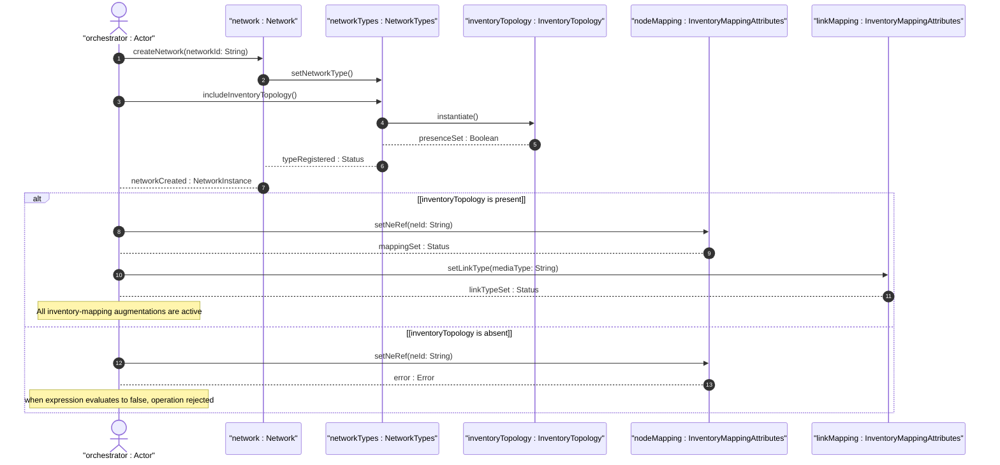

# User Story: Register Inventory Topology Network Type

## Parent Epic
- [ ] #73 - [Network Inventory: Inventory Topology Mapping](https://github.com/gintatkinson/3dgs-030/blob/main/docs/epics/epic-06-inventory-topology-mapping.md) (the inventory-topology presence container is the gating condition for all physical-layer augmentations in this module)

## Domain Object Mapping
- **Primary Domain Objects:** `InventoryTopology` (presence container under `nw:network-types`), `Nw:network` (augmented by `inventory-topology`), `Nw:networkTypes` (augmented container)
- **Actor/Role:** Network Orchestrator (system or operator designating a network instance as a physical underlay topology with inventory mapping, port breakout, and link media classification capabilities)

## BDD Scenario (OOA/OOD Realization)
**As a** Network Orchestrator
**I want to** register a network as an inventory-topology network type by setting the `inventory-topology` presence container
**So that** physical-layer inventory mapping augmentations for nodes, links, and termination points are activated via their `when` expressions

**Given** a network instance "physical-underlay" is being provisioned
**When** the Network Orchestrator includes the `inventory-topology` presence container under `network-types` during network creation
**Then** the network is classified as an inventory-topology type
**And** all child augmentations (node `inventory-mapping-attributes`, link `inventory-mapping-attributes`, TP `inventory-mapping-attributes`, and `port-breakout`) become conditionally valid per their `when` expressions
**And** the network is available to serve as the lowest underlay abstraction level for logical overlay topologies

**Given** an existing network instance "logical-overlay" does NOT contain the `inventory-topology` container
**When** the Network Orchestrator attempts to instantiate `inventory-mapping-attributes` under a node in that network
**Then** the operation is rejected because the `when` expression `'../nw:network-types/nwit:inventory-topology'` evaluates to false
**And** the node is treated as an abstract/logical node without inventory mapping

**Given** the `inventory-topology` container is present on a network
**When** the Network Orchestrator attempts to set child data leaves within the `inventory-topology` container
**Then** the operation is rejected with an `invalid-value` error because the presence container carries no data leaves

## Compliance Verification Table

| Rule | Status |
|------|--------|
| Lifeline aliasing (name : Classifier) | PASS |
| Open return arrows (`-->`) used | PASS |
| Return value assignment signatures | PASS |
| Given-When-Then BDD scenarios present | PASS |
| Mermaid blocks properly closed | PASS |
| No semicolons in Note statements | PASS |
| Combined fragment guards in square brackets | PASS |
| Helper/Calculator delegation for computations | PASS |

## UML Sequence Diagram


## Operational Context
From draft-ietf-ivy-network-inventory-topology-08, Section 4:
> The module augments the "ietf-network-topology" module as follows: Inventory mapping attributes for nodes, and termination points. The corresponding containers augments the topology module with the references to the base network inventory.

From the YANG module schema, Section 5:
> `container inventory-topology` with `presence "Indicates a physical network topology, containing physical-layer attributes including inventory mapping, port breakout capabilities, and link media types."` The container has no data leaves; its existence alone signals physical underlay classification.

Conditional activation: All other augmentations in this module (node, link, TP) include a `when` expression (`'../nw:network-types/nwit:inventory-topology'`) that gates their instantiation.

## Required Features Matrix
- [ ] #68 - [Inventory Topology Network Type](https://github.com/gintatkinson/3dgs-030/blob/main/docs/features/feat-14-inventory-topology-network-type.md) (the `inventory-topology` presence container is the gating condition enabling all downstream inventory mapping augmentations)

## Source References
Structural Schema: [ietf-network-inventory-topology@2026-06-25.yang](https://github.com/gintatkinson/3dgs-030/blob/main/schema/ietf-network-inventory-topology%402026-06-25.yang) (Clause: augment /nw:networks/nw:network/nw:network-types, container inventory-topology with presence)
Normative Specification: [draft-ietf-ivy-network-inventory-topology-08](https://datatracker.ietf.org/doc/html/draft-ietf-ivy-network-inventory-topology) (Clause: Sections 1, 4, 5)

> [!WARNING]
> **Mermaid Block Closing Constraints & Code Fence Integrity:**
> - Every Mermaid diagram MUST be strictly closed with ``` on a new line. Leaking Mermaid blocks or stray/unclosed code fences will fail downstream validation checks.
> - **Semicolon Restriction**: Do NOT use semicolons (`;`) in sequence diagram `Note` statements or message text statements. Semicolons are not allowed. Replace any semicolons with commas, dashes, or spaces.
