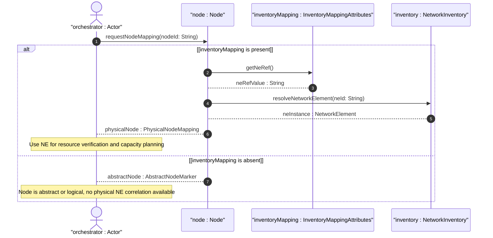

# User Story: Map Topology Node to Network Element for Inventory Correlation

## Parent Epic
- [ ] #73 - [Network Inventory: Inventory Topology Mapping](https://github.com/gintatkinson/3dgs-030/blob/main/docs/epics/epic-06-inventory-topology-mapping.md) (the node-to-NE mapping under inventory-mapping-attributes is a core augmentation establishing physical-to-logical correlation)

## Domain Object Mapping
- **Primary Domain Objects:** `InventoryMappingAttributes` (presence container under `nw:node`), `ne-ref` (leafref to `nwi:ne-id`), `Nw_node` (augmented topology node), `network-element` (inventory NE list entry)
- **Actor/Role:** Service Orchestrator (system performing service provisioning that requires locating the physical NE underlying a logical topology node to verify resource availability)

## BDD Scenario (OOA/OOD Realization)
**As a** Service Orchestrator
**I want to** establish a 1:1 mapping between a topology node and its physical Network Element via the `ne-ref` leaf
**So that** I can correlate logical topology nodes with physical inventory NEs for service provisioning, resource verification, and capacity planning

**Given** an inventory-topology network "campus-topology" is registered and a physical NE "NE-SW1" exists in the base inventory
**When** the Service Orchestrator sets `ne-ref` to "NE-SW1" on node "SW-1" within the `inventory-mapping-attributes` container
**Then** a 1:1 mapping is established between logical node "SW-1" and physical NE "NE-SW1"
**And** the `inventory-mapping-attributes` presence container signals that node "SW-1" is a physical node
**And** subsequent queries to locate the NE for "SW-1" resolve to "NE-SW1" in the inventory

**Given** node "abstract-node-01" does NOT have the `inventory-mapping-attributes` container instantiated
**When** the Service Orchestrator queries the node's inventory mapping
**Then** the node is identified as an abstract/logical node with no physical NE mapping
**And** inventory correlation is not applicable

**Given** a node "SW-1" with `ne-ref` set to "NE-SW1"
**When** the Service Orchestrator attempts to set `ne-ref` to a non-existent NE identifier "NE-UNKNOWN"
**Then** the operation is rejected because the leafref constraint requires the referenced NE to exist in the inventory
**And** an `invalid-value` error is returned

## Compliance Verification Table

| Rule | Status |
|------|--------|
| Lifeline aliasing (name : Classifier) | PASS |
| Open return arrows (`-->`) used | PASS |
| Return value assignment signatures | PASS |
| Given-When-Then BDD scenarios present | PASS |
| Mermaid blocks properly closed | PASS |
| No semicolons in Note statements | PASS |
| Combined fragment guards in square brackets | PASS |
| Helper/Calculator delegation for computations | PASS |

## UML Sequence Diagram


## Operational Context
From draft-ietf-ivy-network-inventory-topology-08, Section 5:
> `container inventory-mapping-attributes` under `/nw:networks/nw:network/nw:node` with presence "If present, it indicates this is a physical node, which maps to a network element. If not present, it indicates it is an abstract node."

> `leaf ne-ref`: type `nwi:ne-ref`, description "Reference to the NE in the inventory that corresponds to this topology node. This reference establishes a 1:1 mapping between the logical node and its physical NE."

From Section 6 (Operational Considerations):
> The inventory-mapping-attributes containers are defined as read-write (config true) to accommodate cases where automatic discovery is not possible, including CPE outside the operator's management domain, leased lines, and planned or hypothetical resources.

## Required Features Matrix
- [ ] #69 - [Node-to-Network-Element Inventory Mapping](https://github.com/gintatkinson/3dgs-030/blob/main/docs/features/feat-15-node-to-ne-mapping.md) (the `ne-ref` leaf within the node `inventory-mapping-attributes` container is the primary mechanism for establishing 1:1 logical-to-physical node correlation)

## Source References
Structural Schema: [ietf-network-inventory-topology@2026-06-25.yang](https://github.com/gintatkinson/3dgs-030/blob/main/schema/ietf-network-inventory-topology%402026-06-25.yang) (Clause: augment /nw:networks/nw:network/nw:node, container inventory-mapping-attributes, leaf ne-ref)
Normative Specification: [draft-ietf-ivy-network-inventory-topology-08](https://datatracker.ietf.org/doc/html/draft-ietf-ivy-network-inventory-topology) (Clause: Sections 3.1, 4, 5, 6)

> [!WARNING]
> **Mermaid Block Closing Constraints & Code Fence Integrity:**
> - Every Mermaid diagram MUST be strictly closed with ``` on a new line. Leaking Mermaid blocks or stray/unclosed code fences will fail downstream validation checks.
> - **Semicolon Restriction**: Do NOT use semicolons (`;`) in sequence diagram `Note` statements or message text statements. Semicolons are not allowed. Replace any semicolons with commas, dashes, or spaces.
