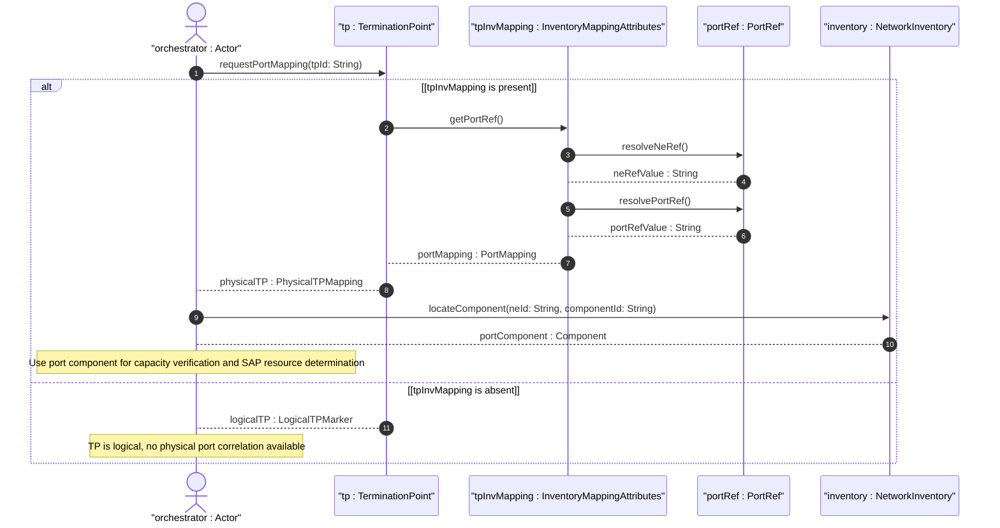

# User Story: Map Termination Point to Physical Port Component for Resource Location

## Parent Epic
- [ ] #73 - [Network Inventory: Inventory Topology Mapping](https://github.com/gintatkinson/3dgs-030/blob/main/docs/epics/epic-06-inventory-topology-mapping.md) (the TP-to-port mapping under termination-point inventory-mapping-attributes enables physical resource location)

## Domain Object Mapping
- **Primary Domain Objects:** `InventoryMappingAttributes` (presence container under `nt:termination-point`), `PortRef` (grouping with `ne-ref` and `port-ref` leafref), `Nt:terminationPoint` (augmented termination point), `component` (inventory port component)
- **Actor/Role:** Service Orchestrator (system locating the physical port underlying a logical termination point to verify resource availability during service provisioning)

## BDD Scenario (OOA/OOD Realization)
**As a** Service Orchestrator
**I want to** establish a 1:1 mapping between a topology termination point and its physical port component via the `port-ref` leaf
**So that** I can locate the physical resource for SAP-to-physical-port correlation during service provisioning and capacity verification

**Given** an inventory-topology network is registered and a termination point "TP-SW1-P1" exists under node "SW-1"
**When** the Service Orchestrator sets `ne-ref` and `port-ref` within the TP's `inventory-mapping-attributes` container, referencing the physical port component "eth-port-1" on NE "NE-SW1"
**Then** a 1:1 mapping is established between logical TP "TP-SW1-P1" and physical port "eth-port-1"
**And** the `inventory-mapping-attributes` presence container signals that the TP is a physical termination point
**And** the orchestrator can resolve the `port-ref` leafref to the exact component entry in the inventory

**Given** a termination point does NOT have the `inventory-mapping-attributes` container instantiated
**When** the Service Orchestrator queries the TP's inventory mapping
**Then** the TP is identified as a logical termination point with no physical port mapping
**And** physical resource location is not applicable

**Given** the `port-ref` value references a non-existent component in the inventory
**When** the mapping is set via edit-config
**Then** the operation is rejected with an `invalid-value` error because the leafref constraint requires the referenced component to exist
**And** the TP remains unmapped

**Given** an SAP's `parent-termination-point` references TP "TP-SW1-P1"
**When** the Service Orchestrator queries the physical resource for the SAP
**Then** the orchestrator follows `port-ref` to locate the physical port "eth-port-1"
**And** the orchestrator can verify port capacity for the requested service

## Compliance Verification Table

| Rule | Status |
|------|--------|
| Lifeline aliasing (name : Classifier) | PASS |
| Open return arrows (`-->`) used | PASS |
| Return value assignment signatures | PASS |
| Given-When-Then BDD scenarios present | PASS |
| Mermaid blocks properly closed | PASS |
| No semicolons in Note statements | PASS |
| Combined fragment guards in square brackets | PASS |
| Helper/Calculator delegation for computations | PASS |

## UML Sequence Diagram


## Operational Context
From draft-ietf-ivy-network-inventory-topology-08, Section 3.1:
> The inventory topology data model provides a physical port reference (port-ref) that enables correlation between logical topology entities and physical inventory components. During service provisioning, the SAP's parent-termination-point can be associated with the inventory topology's port-ref to locate the underlying physical resource.

> Specifically, the "parent-termination-point" of a SAP is mapped to the corresponding "port-ref" in the inventory topology, allowing the orchestrator to locate the physical resource.

From the YANG module schema, Section 5:
> `container inventory-mapping-attributes` under `/nw:networks/nw:network/nw:node/nt:termination-point` uses `nwi:port-ref` grouping with presence "If present, it indicates this is a physical termination point (TP), which maps to a port component. If not present, it indicates it is a logical TP."

## Required Features Matrix
- [ ] #71 - [Termination-Point-to-Port Inventory Mapping](https://github.com/gintatkinson/3dgs-030/blob/main/docs/features/feat-17-tp-to-port-mapping.md) (the `nwi:port-ref` grouping within the TP `inventory-mapping-attributes` container is the mechanism for establishing 1:1 logical-TP-to-physical-port correlation)

## Source References
Structural Schema: [ietf-network-inventory-topology@2026-06-25.yang](https://github.com/gintatkinson/3dgs-030/blob/main/schema/ietf-network-inventory-topology%402026-06-25.yang) (Clause: augment /nw:networks/nw:network/nw:node/nt:termination-point, container inventory-mapping-attributes, uses nwi:port-ref)
Normative Specification: [draft-ietf-ivy-network-inventory-topology-08](https://datatracker.ietf.org/doc/html/draft-ietf-ivy-network-inventory-topology) (Clause: Sections 3.1, 4, 5, Appendix A)

> [!WARNING]
> **Mermaid Block Closing Constraints & Code Fence Integrity:**
> - Every Mermaid diagram MUST be strictly closed with ``` on a new line. Leaking Mermaid blocks or stray/unclosed code fences will fail downstream validation checks.
> - **Semicolon Restriction**: Do NOT use semicolons (`;`) in sequence diagram `Note` statements or message text statements. Semicolons are not allowed. Replace any semicolons with commas, dashes, or spaces.
