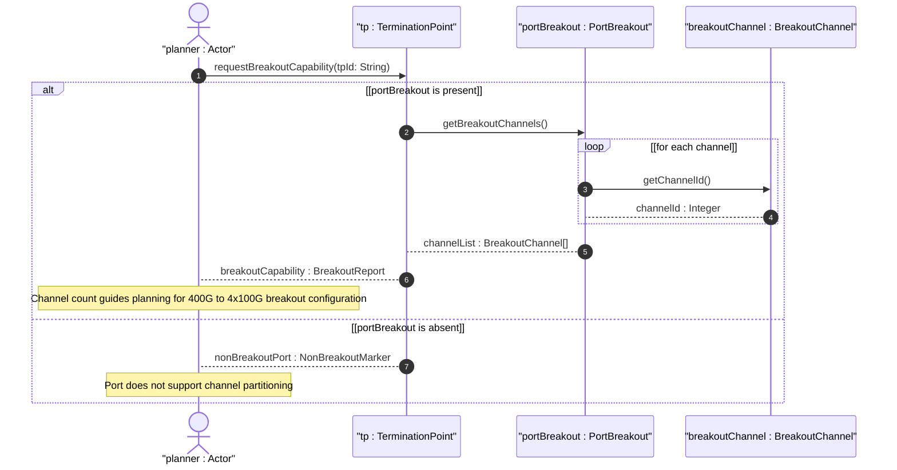

# User Story: Report Port Breakout Capability for High-Density Ethernet Ports

## Parent Epic
- [ ] #73 - [Network Inventory: Inventory Topology Mapping](https://github.com/gintatkinson/3dgs-030/blob/main/docs/epics/epic-06-inventory-topology-mapping.md) (the port-breakout container under termination-point exposes hardware-determined channelization capability)

## Domain Object Mapping
- **Primary Domain Objects:** `PortBreakout` (config false presence container under `nt:termination-point`), `BreakoutChannel` (list keyed by `channel-id`), `channel-id` (uint16 leaf), `Nt_terminationPoint` (augmented termination point)
- **Actor/Role:** Capacity Planner (system or operator reading hardware-determined breakout capability to plan high-speed port partitioning configurations such as 400G to 4x100G)

## BDD Scenario (OOA/OOD Realization)
**As a** Capacity Planner
**I want to** read the breakout-channel list from the `port-breakout` container on a termination point
**So that** I can determine how many independent lower-speed channels the physical port can be partitioned into for flexible interface configuration

**Given** a physical port "400g-1/0/1" is a 400G DR4 port supporting breakout into four independent 100G lanes
**When** the Capacity Planner queries the `port-breakout` container for TP "400g-1/0/1"
**Then** the response includes a `breakout-channel` list with four entries: channel-id 1, 2, 3, and 4
**And** each channel-id is unique within the parent port scope
**And** the list represents the intrinsic partitioning capability regardless of whether the port is currently configured as a trunk or as breakout

**Given** a termination point "1g-1/0/1" represents a standard 1G port that does not support breakout
**When** the Capacity Planner queries the `port-breakout` container for that TP
**Then** the `port-breakout` container is absent from the response
**And** the port is identified as non-breakout-capable

**Given** the `port-breakout` container is present and exposes four breakout channels
**When** the Capacity Planner attempts to modify the `breakout-channel` list via edit-config
**Then** the operation is rejected because the container and its children are `config false`
**And** a read-only violation error is returned

**Given** a breakout-capable port is configured as a trunk (single interface using all four channels)
**When** the Capacity Planner reads `port-breakout`
**Then** all four channels are still reported in the list
**And** the list reflects hardware capability, not current interface configuration

## Compliance Verification Table

| Rule | Status |
|------|--------|
| Lifeline aliasing (name : Classifier) | PASS |
| Open return arrows (`-->`) used | PASS |
| Return value assignment signatures | PASS |
| Given-When-Then BDD scenarios present | PASS |
| Mermaid blocks properly closed | PASS |
| No semicolons in Note statements | PASS |
| Combined fragment guards in square brackets | PASS |
| Helper/Calculator delegation for computations | PASS |

## UML Sequence Diagram


## Operational Context
From draft-ietf-ivy-network-inventory-topology-08, Section 4.2:
> High-density Ethernet ports (e.g., 400 Gb/s DR4) can be split into multiple independent lower-speed channels. The breakout channels represent the intrinsic capability of the port to be partitioned, regardless of whether the port is currently configured as a trunk or as a breakout port.

> The container "port-breakout" is added under the termination-point augmentation. It lists the logical channels into which the single physical port can be divided. Only termination-points whose parent port is breakout-capable need to instantiate the container; otherwise the container is omitted.

> Breakout channel is an atomic resource element obtained by partitioning a breakout port. One physical interface may be associated with one or more breakout channels, but one breakout channel MUST NOT be associated with more than one physical interface.

From Section 6: `port-breakout` is read-only (config false) as it represents hardware-determined state.

## Required Features Matrix
- [ ] #72 - [Port Breakout Capability](https://github.com/gintatkinson/3dgs-030/blob/main/docs/features/feat-18-port-breakout-capability.md) (the read-only `port-breakout` container with `breakout-channel` list is the mechanism for exposing hardware channelization capability)

## Source References
Structural Schema: [ietf-network-inventory-topology@2026-06-25.yang](https://github.com/gintatkinson/3dgs-030/blob/main/schema/ietf-network-inventory-topology%402026-06-25.yang) (Clause: augment /nw:networks/nw:network/nw:node/nt:termination-point, container port-breakout config false, list breakout-channel key channel-id)
Normative Specification: [draft-ietf-ivy-network-inventory-topology-08](https://datatracker.ietf.org/doc/html/draft-ietf-ivy-network-inventory-topology) (Clause: Sections 4.2, 5, 6, Appendix B)

> [!WARNING]
> **Mermaid Block Closing Constraints & Code Fence Integrity:**
> - Every Mermaid diagram MUST be strictly closed with ``` on a new line. Leaking Mermaid blocks or stray/unclosed code fences will fail downstream validation checks.
> - **Semicolon Restriction**: Do NOT use semicolons (`;`) in sequence diagram `Note` statements or message text statements. Semicolons are not allowed. Replace any semicolons with commas, dashes, or spaces.
