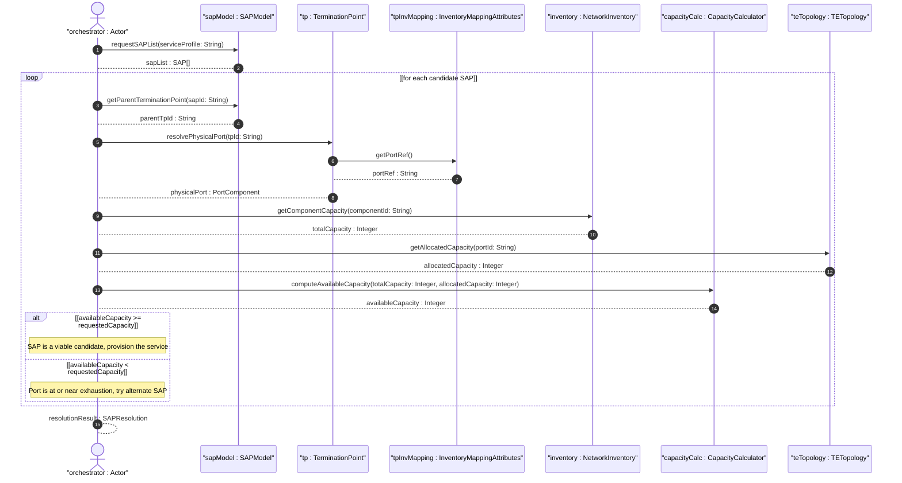

# User Story: Determine Service Attachment Point Physical Resources for Capacity Verification

## Parent Epic
- [ ] #73 - [Network Inventory: Inventory Topology Mapping](https://github.com/gintatkinson/3dgs-030/blob/main/docs/epics/epic-06-inventory-topology-mapping.md) (SAP-to-physical-port correlation combines node mapping, TP mapping, and port breakout capability to compute resource availability)

## Domain Object Mapping
- **Primary Domain Objects:** `SAP` (service attachment point, RFC 9408), `parent-termination-point` (SAP leaf referencing a TP), `InventoryMappingAttributes` (node and TP containers), `PortBreakout` (breakout channel list), `component` (physical port component), `PortRef` (grouping with port-ref leafref)
- **Actor/Role:** Service Orchestrator (system querying SAP physical resources, computing port capacity availability, and selecting alternate SAPs when resources are insufficient)

## BDD Scenario (OOA/OOD Realization)
**As a** Service Orchestrator
**I want to** map an SAP's parent-termination-point to the underlying physical port via the inventory topology and compute available port capacity
**So that** I can verify whether sufficient resources exist to provision a requested service and select alternate SAPs when capacity is exhausted

**Given** SAP "sap-001" has `parent-termination-point` referencing TP "TP-SW1-P1"
**And** TP "TP-SW1-P1" maps to physical port "eth-port-1" on NE "NE-SW1" via `port-ref`
**And** port "eth-port-1" has 10 Gb/s total capacity with 6 Gb/s currently utilized
**When** the Service Orchestrator queries the physical resource for SAP "sap-001"
**Then** the orchestrator resolves the physical port as "eth-port-1"
**And** available capacity is computed as: `availableCapacity = totalCapacity - allocatedCapacity` = 10 Gb/s - 6 Gb/s = 4 Gb/s
**And** the orchestrator determines that a requested 2 Gb/s service can be provisioned on this port

**Given** SAP "sap-002" maps to port "eth-port-2" with 10 Gb/s total capacity at 95% utilization (0.5 Gb/s available)
**When** the Service Orchestrator queries resources for a requested 2 Gb/s service on "sap-002"
**Then** the computed available capacity of 0.5 Gb/s is insufficient
**And** the orchestrator flags the port as a resource bottleneck with a report: "Port eth-port-2 on NE-PE2 is at 95% utilization"
**And** the orchestrator selects an alternate SAP "sap-003" whose underlying port has 8 Gb/s available capacity

**Given** no alternate SAPs have sufficient capacity for the requested service
**When** the orchestrator exhausts all SAP candidates
**Then** the request is flagged for manual intervention
**And** precise inventory bottleneck information is provided to the operator
**And** the bottleneck data feeds into a what-if analysis for hardware upgrade evaluation

**Given** a port supports breakout into four channels (e.g., 400G to 4x100G) and channel 1 is allocated
**When** the Service Orchestrator evaluates capacity for a new service requiring a breakout channel
**Then** available channels are computed as: `availableChannels = totalChannels - allocatedChannels` = 4 - 1 = 3
**And** the orchestrator can assign the service to an available channel

## Compliance Verification Table

| Rule | Status |
|------|--------|
| Lifeline aliasing (name : Classifier) | PASS |
| Open return arrows (`-->`) used | PASS |
| Return value assignment signatures | PASS |
| Given-When-Then BDD scenarios present | PASS |
| Mermaid blocks properly closed | PASS |
| No semicolons in Note statements | PASS |
| Combined fragment guards in square brackets | PASS |
| Helper/Calculator delegation for computations | PASS |

## UML Sequence Diagram


## Operational Context
From draft-ietf-ivy-network-inventory-topology-08, Section 3.1:
> During service provisioning, the orchestrator can issue a query using the SAP data model (e.g., obtaining a list of SAPs across multiple PEs as shown in Appendix A of [RFC9408]), and then uses the inventory topology data model to identify the physical port underlying each candidate SAP. Specifically, the "parent-termination-point" of a SAP is mapped to the corresponding "port-ref" in the inventory topology, allowing the orchestrator to locate the physical resource.

> The orchestrator can then consult other relevant topology models (e.g., [RFC8795]) to verify whether the identified port has adequate capacity for the requested service.

> If the physical port underlying a candidate SAP has insufficient resources (e.g., port speed fully utilized), the orchestrator can select an alternate SAP that maps to a different port with adequate capacity. If no alternative SAP is available, the orchestrator flags the request for manual intervention, providing the operator with precise inventory information about the bottleneck (e.g., "Port GE0/6/1 on NE-PE1 is at 95% utilization").

Derived computation:
- `availableCapacity = totalCapacity - allocatedCapacity` (port capacity adequacy check)
- `bottleneckReport = "Port {port-id} on {ne-id} is at {utilizationPercentage}% utilization"` (when available capacity is insufficient)
- `availableChannels = totalChannels - allocatedChannels` (for breakout-capable ports)
- `utilizationPercentage = (allocatedCapacity / totalCapacity) * 100`

## Required Features Matrix
- [ ] #69 - [Node-to-Network-Element Inventory Mapping](https://github.com/gintatkinson/3dgs-030/blob/main/docs/features/feat-15-node-to-ne-mapping.md) (the ne-ref mapping provides the NE context for the physical port under each SAP)
- [ ] #71 - [Termination-Point-to-Port Inventory Mapping](https://github.com/gintatkinson/3dgs-030/blob/main/docs/features/feat-17-tp-to-port-mapping.md) (the port-ref mapping resolves the SAP's parent-termination-point to the physical port component)
- [ ] #72 - [Port Breakout Capability](https://github.com/gintatkinson/3dgs-030/blob/main/docs/features/feat-18-port-breakout-capability.md) (breakout channel availability informs capacity planning for channelized ports)

## Source References
Structural Schema: [ietf-network-inventory-topology@2026-06-25.yang](https://github.com/gintatkinson/3dgs-030/blob/main/schema/ietf-network-inventory-topology%402026-06-25.yang) (Clause: container inventory-mapping-attributes on node and termination-point, container port-breakout)
Normative Specification: [draft-ietf-ivy-network-inventory-topology-08](https://datatracker.ietf.org/doc/html/draft-ietf-ivy-network-inventory-topology) (Clause: Section 3.1)
Informative References: [RFC 9408](https://www.rfc-editor.org/rfc/rfc9408) (SAP Data Model), [RFC 8795](https://www.rfc-editor.org/rfc/rfc8795) (TE Topology for capacity verification)

> [!WARNING]
> **Mermaid Block Closing Constraints & Code Fence Integrity:**
> - Every Mermaid diagram MUST be strictly closed with ``` on a new line. Leaking Mermaid blocks or stray/unclosed code fences will fail downstream validation checks.
> - **Semicolon Restriction**: Do NOT use semicolons (`;`) in sequence diagram `Note` statements or message text statements. Semicolons are not allowed. Replace any semicolons with commas, dashes, or spaces.
