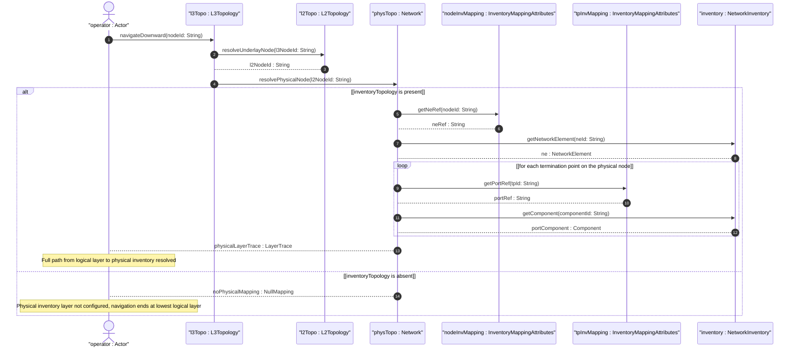

# User Story: Navigate Multi-Layer Network Topology Down to Physical Inventory Layer

## Parent Epic
- [ ] #73 - [Network Inventory: Inventory Topology Mapping](https://github.com/gintatkinson/3dgs-030/blob/main/docs/epics/epic-06-inventory-topology-mapping.md) (multi-layer navigation from logical layers down to physical inventory is enabled by the inventory-topology mapping augmentations)

## Domain Object Mapping
- **Primary Domain Objects:** `Nw:network` (multi-layer topology instances), `Nw_networkTypes` (layer classification), `InventoryTopology` (physical underlay presence container), `InventoryMappingAttributes` (node and TP containers), `ne-ref` and `port-ref` (inventory references)
- **Actor/Role:** Network Operator (system or engineer traversing from a logical network layer down through the topology hierarchy to the physical inventory layer for troubleshooting, capacity planning, or fault isolation)

## BDD Scenario (OOA/OOD Realization)
**As a** Network Operator
**I want to** navigate from a logical network layer (e.g., Layer 2 or Layer 3) down through the underlay topology to the physical inventory layer
**So that** I can trace service paths to their physical resources for troubleshooting, fault isolation, and end-to-end capacity planning

**Given** a multi-layer network consists of a Layer 3 overlay topology "l3-overlay", a Layer 2 underlay topology "l2-underlay", and a physical inventory-topology network "physical-underlay"
**And** the "physical-underlay" network has the `inventory-topology` presence container set
**And** nodes in "physical-underlay" have `ne-ref` mappings to physical NEs
**When** the Network Operator starts at a node in the L3 overlay and follows the underlay references downward
**Then** the operator reaches the L2 underlay topology via the base topology inter-layer references
**And** continues to the physical inventory-topology network "physical-underlay"
**And** resolves each physical node to its corresponding NE in the base inventory via `ne-ref`
**And** resolves each termination point to its physical port component via `port-ref`

**Given** a fault is detected on a service traversing the multi-layer topology
**When** the Network Operator performs root-cause analysis by navigating from the logical service layer downward
**Then** the fault is traced to a specific physical port "eth-port-5" on NE "NE-CR1"
**And** the operator can access detailed inventory information (hardware revision, manufacturing date, port speed) for the affected component

**Given** a network has only logical layers with no physical inventory-topology underlay
**When** the Network Operator attempts to navigate to the physical inventory layer
**Then** navigation stops at the lowest logical layer
**And** no physical NE or port information is available for correlation

## Compliance Verification Table

| Rule | Status |
|------|--------|
| Lifeline aliasing (name : Classifier) | PASS |
| Open return arrows (`-->`) used | PASS |
| Return value assignment signatures | PASS |
| Given-When-Then BDD scenarios present | PASS |
| Mermaid blocks properly closed | PASS |
| No semicolons in Note statements | PASS |
| Combined fragment guards in square brackets | PASS |
| Helper/Calculator delegation for computations | PASS |

## UML Sequence Diagram


## Operational Context
From draft-ietf-ivy-network-inventory-topology-08, Section 3.2:
> A multi-layer network encompasses multiple layers (e.g., Layer 2 and Layer 3, or Optical Transport Network (OTN) and Wavelength Division Multiplexing (WDM) layers). A multi-layer network topology comprises nodes, links, and termination points that can belong to different layers.

> The topology models support navigation across the different layers, down to the physical layer, as defined in Section 4.4.9 of the base network topology data model. The navigation between the physical layer and the network inventory is outside the scope of the topology models and is addressed in this document.

From Section 1:
> This YANG data model can be used to represent a physical network instance at the lowest underlay abstraction level, as described in the base network topology data model. Alternatively, it can be used in conjunction with existing network topology models, such as the SAP topology model, Layer 2 topology model, Layer 3 topology model, TE topology model, and OTN topology model, when they contain nodes, links, or termination points belonging to the lowest underlay level.

## Required Features Matrix
- [ ] #68 - [Inventory Topology Network Type](https://github.com/gintatkinson/3dgs-030/blob/main/docs/features/feat-14-inventory-topology-network-type.md) (the inventory-topology presence container signals that a network serves as the physical underlay for multi-layer navigation)
- [ ] #69 - [Node-to-Network-Element Inventory Mapping](https://github.com/gintatkinson/3dgs-030/blob/main/docs/features/feat-15-node-to-ne-mapping.md) (the ne-ref mapping resolves physical nodes to NEs during downward navigation)
- [ ] #71 - [Termination-Point-to-Port Inventory Mapping](https://github.com/gintatkinson/3dgs-030/blob/main/docs/features/feat-17-tp-to-port-mapping.md) (the port-ref mapping resolves TPs to physical port components at the lowest navigation level)

## Source References
Structural Schema: [ietf-network-inventory-topology@2026-06-25.yang](https://github.com/gintatkinson/3dgs-030/blob/main/schema/ietf-network-inventory-topology%402026-06-25.yang) (Clause: container inventory-topology, container inventory-mapping-attributes on node and termination-point)
Normative Specification: [draft-ietf-ivy-network-inventory-topology-08](https://datatracker.ietf.org/doc/html/draft-ietf-ivy-network-inventory-topology) (Clause: Sections 1, 3.2)
Informative References: Base Network Topology Data Model, Section 4.4.9 (multi-layer network navigation), SAP Topology Model, Layer 2 Topology Model, Layer 3 Topology Model, TE Topology Model, OTN Topology Model

> [!WARNING]
> **Mermaid Block Closing Constraints & Code Fence Integrity:**
> - Every Mermaid diagram MUST be strictly closed with ``` on a new line. Leaking Mermaid blocks or stray/unclosed code fences will fail downstream validation checks.
> - **Semicolon Restriction**: Do NOT use semicolons (`;`) in sequence diagram `Note` statements or message text statements. Semicolons are not allowed. Replace any semicolons with commas, dashes, or spaces.
