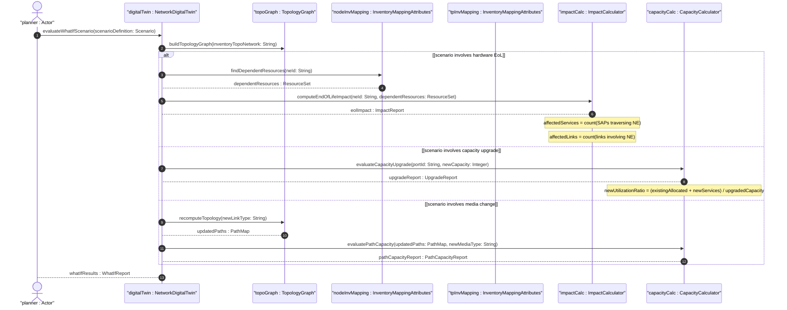

# User Story: Evaluate What-If Network Digital Twin Scenarios Using Inventory Topology

## Parent Epic
- [ ] #73 - [Network Inventory: Inventory Topology Mapping](https://github.com/gintatkinson/3dgs-030/blob/main/docs/epics/epic-06-inventory-topology-mapping.md) (physical-to-logical mapping provides the foundational data for NDT and SIMAP what-if analysis)

## Domain Object Mapping
- **Primary Domain Objects:** `Nw:network` (topology underlay), `InventoryMappingAttributes` (node and TP mappings), `ne-ref` and `port-ref` (inventory references), `PortBreakout` (breakout channels), `network-element` and `component` (inventory entities), `SAP` (service attachment points)
- **Actor/Role:** Network Planner (system or operator running what-if analysis using a Network Digital Twin or SIMAP model to predict impact of hardware changes, evaluate path optimization, and assess service availability under resource constraints)

## BDD Scenario (OOA/OOD Realization)
**As a** Network Planner
**I want to** run what-if scenarios using the inventory topology mapping as the foundational data layer for a Network Digital Twin
**So that** I can predict the impact of hardware End-of-Life, evaluate path re-optimization under resource constraints, and assess service availability before making infrastructure changes

**Given** a Network Digital Twin model is configured with the physical underlay topology and all inventory mappings (ne-ref, port-ref, link-type)
**And** the current hardware inventory shows that NE "NE-CR1" has an End-of-Life date of 2027-01-15
**When** the Network Planner runs a what-if scenario: "Remove NE-CR1 from topology on 2027-01-15"
**Then** the digital twin identifies all nodes, links, and TPs that depend on NE "NE-CR1" via `ne-ref` mappings
**And** computes: `affectedServices = count(SAPs traversing NE-CR1)` and `affectedLinks = count(links with source or destination on NE-CR1)`
**And** evaluates alternate paths through surviving NEs to determine if services can be re-provisioned
**And** reports services that cannot be re-provisioned due to resource constraints for manual remediation

**Given** a proposed capacity upgrade from 100G to 400G on port "eth-port-1"
**When** the Network Planner runs a what-if scenario: "Upgrade port eth-port-1 to 400G and enable breakout of 4x100G"
**Then** the digital twin computes the new channel allocation: `breakoutChannels = 4` with `perChannelCapacity = 100G`
**And** evaluates which services can be migrated from congested ports to the new channels
**And** produces a utilization forecast: `newUtilizationRatio = (existingAllocated + newServices) / totalUpgradedCapacity`

**Given** a network link "Link-SW1-SW2" has `link-type` set to `nwit:fiber`
**When** the Network Planner runs a what-if scenario: "Replace fiber with microwave link"
**Then** the digital twin updates the `link-type` to `nwit:microwave`
**And** recomputes path capacity based on microwave-specific bandwidth characteristics
**And** identifies services that may experience reduced throughput after the medium change

## Compliance Verification Table

| Rule | Status |
|------|--------|
| Lifeline aliasing (name : Classifier) | PASS |
| Open return arrows (`-->`) used | PASS |
| Return value assignment signatures | PASS |
| Given-When-Then BDD scenarios present | PASS |
| Mermaid blocks properly closed | PASS |
| No semicolons in Note statements | PASS |
| Combined fragment guards in square brackets | PASS |
| Helper/Calculator delegation for computations | PASS |

## UML Sequence Diagram


## Operational Context
From draft-ietf-ivy-network-inventory-topology-08, Section 3.3:
> [I-D.irtf-nmrg-network-digital-twin-arch] defines Network Digital Twin (NDT) as a virtual representation of the physical network. Such representation is meant to be used to analyze, diagnose, emulate, and then manage the physical network based on data, models, and interfaces.

> [I-D.ietf-nmop-simap-concept] defines Service and Infrastructure Maps (SIMAP) as an abstraction model that provides a unified view of both service and infrastructure information, enabling correlation between service requirements and underlying resource capabilities.

> Both architectures require accurate mapping between logical network topology and physical inventory as a foundational data layer. This model provides the essential physical resource information to such systems, enabling them to perform accurate "what-if" analysis (e.g., impact prediction of hardware End-of-Life, path re-optimization under resource constraints, service availability assessment).

Derived computations:
- `affectedServices = count(SAPs where parent-termination-point maps to a port on the affected NE)`
- `affectedLinks = count(nt:link where source-node or dest-node maps to the affected NE via ne-ref)`
- `newUtilizationRatio = (existingAllocatedCapacity + projectedNewServicesCapacity) / totalUpgradedCapacity`
- `serviceReProvisionability = evaluate alternate paths through surviving NEs and adequate-capacity ports`
- `bottleneckServices = services with no viable alternate path after the simulated change`

## Required Features Matrix
- [ ] #68 - [Inventory Topology Network Type](https://github.com/gintatkinson/3dgs-030/blob/main/docs/features/feat-14-inventory-topology-network-type.md) (the physical underlay designation provides the foundational topology for digital twin construction)
- [ ] #69 - [Node-to-Network-Element Inventory Mapping](https://github.com/gintatkinson/3dgs-030/blob/main/docs/features/feat-15-node-to-ne-mapping.md) (ne-ref enables dependency analysis, EoL impact computation, and affected service identification)
- [ ] #70 - [Link Media Type Classification](https://github.com/gintatkinson/3dgs-030/blob/main/docs/features/feat-16-link-media-type-classification.md) (link-type enables media change what-if analysis and path capacity recomputation)
- [ ] #71 - [Termination-Point-to-Port Inventory Mapping](https://github.com/gintatkinson/3dgs-030/blob/main/docs/features/feat-17-tp-to-port-mapping.md) (port-ref enables capacity upgrade what-if analysis and service-to-port correlation)
- [ ] #72 - [Port Breakout Capability](https://github.com/gintatkinson/3dgs-030/blob/main/docs/features/feat-18-port-breakout-capability.md) (breakout-channel data provides channel-aware capacity upgrade and allocation planning)

## Source References
Structural Schema: [ietf-network-inventory-topology@2026-06-25.yang](https://github.com/gintatkinson/3dgs-030/blob/main/schema/ietf-network-inventory-topology%402026-06-25.yang) (Clause: all augmentations provide the foundational data layer for NDT/SIMAP what-if analysis)
Normative Specification: [draft-ietf-ivy-network-inventory-topology-08](https://datatracker.ietf.org/doc/html/draft-ietf-ivy-network-inventory-topology) (Clause: Section 3.3)
Informative References: [draft-irtf-nmrg-network-digital-twin-arch](https://datatracker.ietf.org/doc/html/draft-irtf-nmrg-network-digital-twin-arch), [draft-ietf-nmop-simap-concept](https://datatracker.ietf.org/doc/html/draft-ietf-nmop-simap-concept)

> [!WARNING]
> **Mermaid Block Closing Constraints & Code Fence Integrity:**
> - Every Mermaid diagram MUST be strictly closed with ``` on a new line. Leaking Mermaid blocks or stray/unclosed code fences will fail downstream validation checks.
> - **Semicolon Restriction**: Do NOT use semicolons (`;`) in sequence diagram `Note` statements or message text statements. Semicolons are not allowed. Replace any semicolons with commas, dashes, or spaces.
