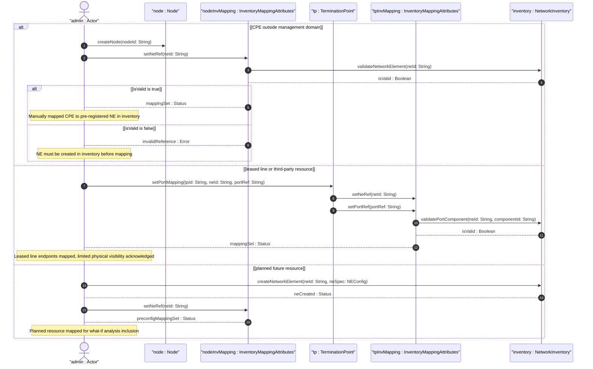

# User Story: Manually Configure NE and Port Mappings for Non-Discoverable Resources

## Parent Epic
- [ ] #73 - [Network Inventory: Inventory Topology Mapping](https://github.com/gintatkinson/3dgs-030/blob/main/docs/epics/epic-06-inventory-topology-mapping.md) (manual configuration of inventory-mapping-attributes for non-discoverable resources is an operational requirement per Section 6)

## Domain Object Mapping
- **Primary Domain Objects:** `InventoryMappingAttributes` (config true containers on node and termination-point), `ne-ref` (leafref, writable), `port-ref` (leafref, writable), `PortRef` (grouping), `network-element` (inventory NE entry)
- **Actor/Role:** Network Administrator (operator manually writing configuration for CPE, leased lines, and planned resources where automatic discovery is unavailable)

## BDD Scenario (OOA/OOD Realization)
**As a** Network Administrator
**I want to** manually configure the `ne-ref` and `port-ref` mappings for topology nodes and termination points representing non-discoverable resources
**So that** topology-to-inventory correlation is maintained even when automatic network discovery cannot reach the target devices

**Given** a CPE device "CPE-001" is outside the operator's management domain and cannot be auto-discovered
**When** the Network Administrator manually creates a node "CPE-001" in the inventory-topology network and sets `ne-ref` to a pre-registered NE "NE-CPE001"
**Then** the manual mapping establishes a 1:1 correlation between the logical node and physical NE
**And** the `inventory-mapping-attributes` container signals that the node is a physical node with intentional manual mapping

**Given** a leased fiber line from a third-party carrier connects site A to site B
**When** the Network Administrator manually configures the link's `inventory-mapping-attributes` with `link-type` set to `nwit:leased-fiber`
**And** manually maps termination points to known physical port components at the operator-managed endpoints
**Then** the leased link and its endpoint ports are correlated with the inventory topology
**And** limited physical attribute visibility is acknowledged via the `leased-fiber` identity

**Given** a planned future deployment of NE "NE-FUTURE1" that does not yet exist in the live inventory
**When** the Network Administrator creates the NE in the inventory database and then manually maps nodes and TPs to it using `ne-ref` and `port-ref`
**Then** the topology-to-inventory mapping is pre-configured for the planned resource
**And** what-if analysis can include the planned resource in capacity and path evaluations

**Given** an NE "NE-AUTO1" is successfully auto-discovered but a specific port mapping could not be resolved
**When** the Network Administrator manually sets only the `port-ref` on the relevant termination point while leaving the auto-discovered `ne-ref` intact
**Then** the partial manual override supplements the auto-discovered data without overwriting it
**And** the TP is fully mapped for service provisioning

## Compliance Verification Table

| Rule | Status |
|------|--------|
| Lifeline aliasing (name : Classifier) | PASS |
| Open return arrows (`-->`) used | PASS |
| Return value assignment signatures | PASS |
| Given-When-Then BDD scenarios present | PASS |
| Mermaid blocks properly closed | PASS |
| No semicolons in Note statements | PASS |
| Combined fragment guards in square brackets | PASS |
| Helper/Calculator delegation for computations | PASS |

## UML Sequence Diagram


## Operational Context
From draft-ietf-ivy-network-inventory-topology-08, Section 6:
> This model enables a network controller to report discovered network topology and inventory information. Automatic discovery serves as the primary mechanism, with selective configuration capabilities provided for scenarios where discovery is not feasible.

> The inventory-mapping-attributes containers are defined as read-write (config true) to accommodate cases where automatic discovery is not possible, including:
> - Customer-premises equipment (CPE) outside the operator's management domain
> - Leased lines and third-party transport resources
> - Planned or hypothetical resources for future deployment

> In these cases, the operator manually configures the mapping to maintain accurate topology-to-inventory correlation.

The following nodes are read-only (config false) as they represent hardware-determined state:
> `port-breakout`: Hardware capability determined by physical port characteristics

From the YANG module schema: The `inventory-mapping-attributes` containers on node and termination-point are `config true` (the default), making them writable for manual configuration.

## Required Features Matrix
- [ ] #69 - [Node-to-Network-Element Inventory Mapping](https://github.com/gintatkinson/3dgs-030/blob/main/docs/features/feat-15-node-to-ne-mapping.md) (the ne-ref leaf is config-writable, enabling manual CPE and planned resource mapping)
- [ ] #71 - [Termination-Point-to-Port Inventory Mapping](https://github.com/gintatkinson/3dgs-030/blob/main/docs/features/feat-17-tp-to-port-mapping.md) (the port-ref leaf is config-writable, enabling manual leased line and third-party endpoint mapping)

## Source References
Structural Schema: [ietf-network-inventory-topology@2026-06-25.yang](https://github.com/gintatkinson/3dgs-030/blob/main/schema/ietf-network-inventory-topology%402026-06-25.yang) (Clause: config true containers inventory-mapping-attributes on node and termination-point)
Normative Specification: [draft-ietf-ivy-network-inventory-topology-08](https://datatracker.ietf.org/doc/html/draft-ietf-ivy-network-inventory-topology) (Clause: Section 6)

> [!WARNING]
> **Mermaid Block Closing Constraints & Code Fence Integrity:**
> - Every Mermaid diagram MUST be strictly closed with ``` on a new line. Leaking Mermaid blocks or stray/unclosed code fences will fail downstream validation checks.
> - **Semicolon Restriction**: Do NOT use semicolons (`;`) in sequence diagram `Note` statements or message text statements. Semicolons are not allowed. Replace any semicolons with commas, dashes, or spaces.
