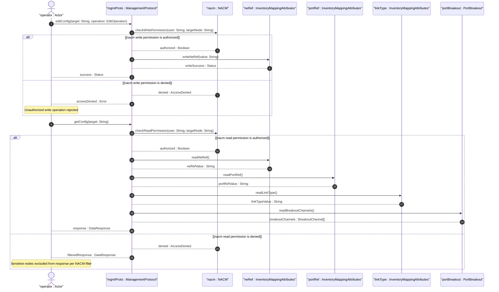

# User Story: Enforce Access Control on Topology-Inventory Mapping Nodes

## Parent Epic
- [ ] #73 - [Network Inventory: Inventory Topology Mapping](https://github.com/gintatkinson/3dgs-030/blob/main/docs/epics/epic-06-inventory-topology-mapping.md) (access control for ne-ref, port-ref, link-type, and port-breakout is a security requirement per Section 7)

## Domain Object Mapping
- **Primary Domain Objects:** `ne-ref` (sensitive writable leaf on node and TP), `port-ref` (sensitive writable leaf on TP), `link-type` (sensitive writable leaf on link), `port-breakout` (read-only container exposing hardware capabilities), `InventoryMappingAttributes` (containers housing sensitive leaves)
- **Actor/Role:** Security Administrator (operator defining and enforcing access control policies on topology-inventory mapping nodes to prevent unauthorized read/write operations)

## BDD Scenario (OOA/OOD Realization)
**As a** Security Administrator
**I want to** enforce access control rules on the `ne-ref`, `port-ref`, `link-type`, and `port-breakout` data nodes via NACM
**So that** unauthorized modification cannot corrupt logical-to-physical topology mappings, and sensitive network infrastructure details are not exposed to unauthorized readers

**Given** a NETCONF/RESTCONF user "operator-1" has NACM write permission for `ne-ref` under node inventory-mapping-attributes
**When** "operator-1" issues an edit-config to set `ne-ref` on node "SW-1" to "NE-SW1"
**Then** the operation succeeds and the mapping is updated

**Given** a NETCONF/RESTCONF user "readonly-user" does NOT have NACM write permission for `port-ref`
**When** "readonly-user" issues an edit-config to modify `port-ref` on a termination point
**Then** the operation is denied with an `access-denied` error
**And** the existing mapping is preserved unchanged

**Given** a NETCONF/RESTCONF user "guest" does NOT have NACM read permission for `ne-ref`
**When** "guest" issues a get-config query on a topology network containing NE mappings
**Then** the `ne-ref` values are filtered from the response per NACM rules
**And** no network infrastructure details are leaked

**Given** a NETCONF/RESTCONF user "operator-2" has read permission for `port-breakout`
**When** "operator-2" issues a get query for a termination point with breakout capability
**Then** the `port-breakout` container and its `breakout-channel` list are returned in the response

**Given** a NETCONF/RESTCONF user "malicious-user" does NOT have read permission for `port-breakout`
**When** "malicious-user" issues a get query targeting the `port-breakout` container
**Then** the `port-breakout` data is excluded from the response per NACM rules
**And** no hardware capability information is exposed

**Given** a NETCONF/RESTCONF user "attacker" attempts to modify `link-type` without write permission
**When** the write operation is processed
**Then** NACM denies the operation with `access-denied`
**And** the link's media type classification is not corrupted

## Compliance Verification Table

| Rule | Status |
|------|--------|
| Lifeline aliasing (name : Classifier) | PASS |
| Open return arrows (`-->`) used | PASS |
| Return value assignment signatures | PASS |
| Given-When-Then BDD scenarios present | PASS |
| Mermaid blocks properly closed | PASS |
| No semicolons in Note statements | PASS |
| Combined fragment guards in square brackets | PASS |
| Helper/Calculator delegation for computations | PASS |

## UML Sequence Diagram


## Operational Context
From draft-ietf-ivy-network-inventory-topology-08, Section 7:
> The Network Configuration Access Control Model (NACM) [RFC8341] provides the means to restrict access for particular NETCONF or RESTCONF users to a preconfigured subset of all available NETCONF or RESTCONF protocol operations and content.

> There are a number of data nodes defined in this YANG module that are writable/creatable/deletable (i.e., "config true", which is the default). All writable data nodes are likely to be sensitive or vulnerable in some network environments. Write operations (e.g., edit-config) and delete operations to these data nodes without proper protection or authentication can have a negative effect on network operations.

> 'ne-ref', 'port-ref', 'link-type': These nodes are sensitive as they establish the mapping between logical topology and physical inventory. Unauthorized modification could lead to incorrect resource allocation or service disruption.

> 'ne-ref': The references may be used to track the set of network elements. While read-only, they may reveal network infrastructure details.

> 'port-breakout': This node exposes hardware capabilities.

From Section 7: Secure transport (SSH, TLS, QUIC) with mutual authentication is required for YANG-based management protocols (NETCONF, RESTCONF).

## Required Features Matrix
- [ ] #68 - [Inventory Topology Network Type](https://github.com/gintatkinson/3dgs-030/blob/main/docs/features/feat-14-inventory-topology-network-type.md) (the inventory-topology network type gating the scope of protected write operations)
- [ ] #69 - [Node-to-Network-Element Inventory Mapping](https://github.com/gintatkinson/3dgs-030/blob/main/docs/features/feat-15-node-to-ne-mapping.md) (ne-ref is a sensitive writable node requiring access control per Section 7)
- [ ] #70 - [Link Media Type Classification](https://github.com/gintatkinson/3dgs-030/blob/main/docs/features/feat-16-link-media-type-classification.md) (link-type is a sensitive writable node requiring access control per Section 7)
- [ ] #71 - [Termination-Point-to-Port Inventory Mapping](https://github.com/gintatkinson/3dgs-030/blob/main/docs/features/feat-17-tp-to-port-mapping.md) (port-ref is a sensitive writable node requiring access control per Section 7)
- [ ] #72 - [Port Breakout Capability](https://github.com/gintatkinson/3dgs-030/blob/main/docs/features/feat-18-port-breakout-capability.md) (port-breakout exposes hardware capabilities and requires read-access control per Section 7)

## Source References
Structural Schema: [ietf-network-inventory-topology@2026-06-25.yang](https://github.com/gintatkinson/3dgs-030/blob/main/schema/ietf-network-inventory-topology%402026-06-25.yang) (Clause: all config true and config false nodes are subject to NACM access control)
Normative Specification: [draft-ietf-ivy-network-inventory-topology-08](https://datatracker.ietf.org/doc/html/draft-ietf-ivy-network-inventory-topology) (Clause: Section 7)
Normative Reference: [RFC 8341](https://www.rfc-editor.org/rfc/rfc8341) (Network Configuration Access Control Model)

> [!WARNING]
> **Mermaid Block Closing Constraints & Code Fence Integrity:**
> - Every Mermaid diagram MUST be strictly closed with ``` on a new line. Leaking Mermaid blocks or stray/unclosed code fences will fail downstream validation checks.
> - **Semicolon Restriction**: Do NOT use semicolons (`;`) in sequence diagram `Note` statements or message text statements. Semicolons are not allowed. Replace any semicolons with commas, dashes, or spaces.
