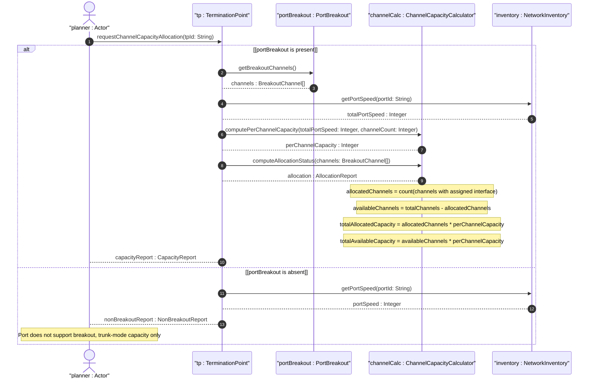

# User Story: Calculate Port Breakout Channel Capacity Allocation for Channelized Interfaces

## Parent Epic
- [ ] #73 - [Network Inventory: Inventory Topology Mapping](https://github.com/gintatkinson/3dgs-030/blob/main/docs/epics/epic-06-inventory-topology-mapping.md) (port breakout channel capacity calculation is a derived computation over the breakout-channel list)

## Domain Object Mapping
- **Primary Domain Objects:** `PortBreakout` (config false presence container), `BreakoutChannel` (list keyed by `channel-id`), `channel-id` (uint16 leaf), `Nt:terminationPoint` (augmented termination point), `component` (physical port component with speed attribute)
- **Actor/Role:** Capacity Planner (system computing per-channel capacity, total aggregate capacity, and channel allocation ratios for breakout-capable ports to plan interface partitioning configurations)

## BDD Scenario (OOA/OOD Realization)
**As a** Capacity Planner
**I want to** compute the per-channel capacity, total aggregate port capacity, and available channel allocation for breakout-capable ports
**So that** I can plan channel assignment for services requiring specific bandwidth, determine whether a trunk or breakout configuration is optimal, and track channel utilization

**Given** a port has total capacity `P` (e.g., 400 Gb/s) and supports breakout into `N` channels (e.g., 4)
**When** the Capacity Planner computes the per-channel capacity
**Then** per-channel capacity is: `perChannelCapacity = P / N` = 400 Gb/s / 4 = 100 Gb/s per channel
**And** this represents the intrinsic hardware capability: each channel runs at nominal speed when configured as breakout

**Given** a breakout-capable port has 4 channels: channel-id 1 is allocated to Service A, channel-id 2 is allocated to Service B, channel-ids 3 and 4 are unallocated
**When** the Capacity Planner computes channel allocation status
**Then** allocated channels = 2 (channels 1, 2)
**And** available channels = 2 (channels 3, 4)
**And** the allocation ratio is: `allocationRatio = allocatedChannels / totalChannels` = 2 / 4 = 0.5 (50% utilization)
**And** total allocated capacity = `allocatedChannels * perChannelCapacity` = 2 * 100 Gb/s = 200 Gb/s
**And** total available capacity = `availableChannels * perChannelCapacity` = 2 * 100 Gb/s = 200 Gb/s

**Given** a port with 0 breakout channels (non-breakout port, `port-breakout` container absent)
**When** the Capacity Planner attempts to compute breakout channel allocation
**Then** the port is reported as "non-breakout-capable"
**And** total capacity equals the port's nominal speed (trunk mode only)
**And** no channel-based allocation metrics are applicable

**Given** a configured trunk port uses all 4 breakout channels as a single interface
**When** the Capacity Planner computes channel allocation
**Then** all 4 channels are reported as "trunk-bonded" (allocated to the single trunk interface)
**And** the aggregate capacity is reported as `totalChannels * perChannelCapacity` = 400 Gb/s
**And** no individual channels are available for separate service assignment

## Compliance Verification Table

| Rule | Status |
|------|--------|
| Lifeline aliasing (name : Classifier) | PASS |
| Open return arrows (`-->`) used | PASS |
| Return value assignment signatures | PASS |
| Given-When-Then BDD scenarios present | PASS |
| Mermaid blocks properly closed | PASS |
| No semicolons in Note statements | PASS |
| Combined fragment guards in square brackets | PASS |
| Helper/Calculator delegation for computations | PASS |

## UML Sequence Diagram


## Operational Context
From draft-ietf-ivy-network-inventory-topology-08, Section 4.2:
> High-density Ethernet ports (e.g., 400 Gb/s DR4) can be split into multiple independent lower-speed channels. The breakout channels represent the intrinsic capability of the port to be partitioned, regardless of whether the port is currently configured as a trunk or as a breakout port.

> Breakout channel is an atomic resource element obtained by partitioning a breakout port. One physical interface may be associated with one or more breakout channels, but one breakout channel MUST NOT be associated with more than one physical interface.

From Annex B: JSON example of a 400 Gb/s DR4 port with 4 breakout channels (channel-id 1 through 4), demonstrating the minimal encoding of the `port-breakout` container.

Derived computations:
- `perChannelCapacity(Homogeneous) = totalPortCapacity / channelCount` (uniform breakout, e.g., 400G / 4 = 100G per channel)
- `allocatedChannels = count(breakout-channel associated with an active interface)`
- `availableChannels = totalChannels - allocatedChannels`
- `allocationRatio = allocatedChannels / totalChannels`
- `totalAllocatedCapacity = allocatedChannels * perChannelCapacity`
- `totalAvailableCapacity = availableChannels * perChannelCapacity`
- `aggregateTrunkCapacity = totalChannels * perChannelCapacity` (when configured as a single trunk)

The `channel-id` values are uint16 (0..65535), unique within the parent port scope. Channel capacity is derived from the parent port's speed, not encoded in the schema directly.

## Required Features Matrix
- [ ] #72 - [Port Breakout Capability](https://github.com/gintatkinson/3dgs-030/blob/main/docs/features/feat-18-port-breakout-capability.md) (the breakout-channel list and parent port speed are the inputs for channel capacity computation and allocation analysis)

## Source References
Structural Schema: [ietf-network-inventory-topology@2026-06-25.yang](https://github.com/gintatkinson/3dgs-030/blob/main/schema/ietf-network-inventory-topology%402026-06-25.yang) (Clause: container port-breakout config false, list breakout-channel key channel-id uint16)
Normative Specification: [draft-ietf-ivy-network-inventory-topology-08](https://datatracker.ietf.org/doc/html/draft-ietf-ivy-network-inventory-topology) (Clause: Sections 4.2, 5, Appendix B)

> [!WARNING]
> **Mermaid Block Closing Constraints & Code Fence Integrity:**
> - Every Mermaid diagram MUST be strictly closed with ``` on a new line. Leaking Mermaid blocks or stray/unclosed code fences will fail downstream validation checks.
> - **Semicolon Restriction**: Do NOT use semicolons (`;`) in sequence diagram `Note` statements or message text statements. Semicolons are not allowed. Replace any semicolons with commas, dashes, or spaces.
