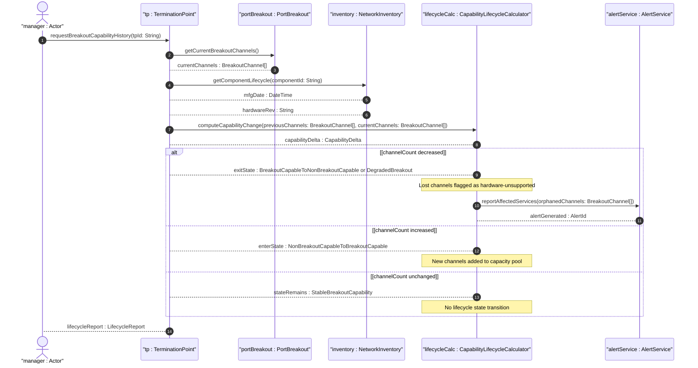
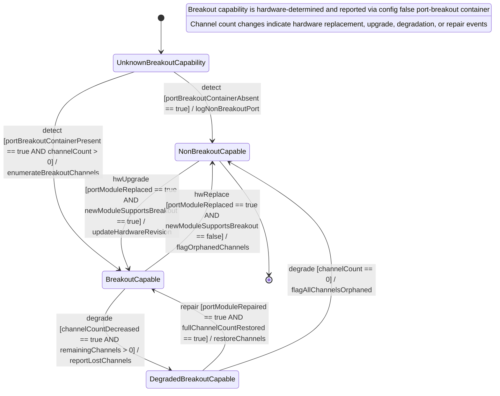

# User Story: Track Port Breakout Hardware Capability Lifecycle Changes

## Parent Epic
- [ ] #73 - [Network Inventory: Inventory Topology Mapping](https://github.com/gintatkinson/3dgs-030/blob/main/docs/epics/epic-06-inventory-topology-mapping.md) (port-breakout capability changes represent hardware lifecycle state transitions per operational considerations)

## Domain Object Mapping
- **Primary Domain Objects:** `PortBreakout` (config false presence container, hardware-determined state), `BreakoutChannel` (list keyed by `channel-id`), `component` (physical port component, potentially replaced during lifecycle), `component/mfg-date` (manufacturing date), `component/hardware-rev` (hardware revision)
- **Actor/Role:** Lifecycle Manager (system or operator tracking port breakout capability changes resulting from hardware replacement, upgrade, or degradation events that alter the breakout channel list)

## BDD Scenario (OOA/OOD Realization)
**As a** Lifecycle Manager
**I want to** detect and track changes to the `port-breakout` container across hardware lifecycle events
**So that** I can recognize when a port's breakout capability changes due to hardware replacement or degradation, and update capacity plans accordingly

**Given** a termination point "TP-SW1-P1" currently reports a `port-breakout` container with 4 breakout channels (400G DR4 port)
**When** the physical port hardware is replaced with an older module that does not support breakout
**Then** the next read of `port-breakout` shows the container is absent (hardware no longer supports partitioning)
**And** the Lifecycle Manager detects a state transition from `BreakoutCapable` to `NonBreakoutCapable`
**And** all previously allocated breakout channels are flagged as "hardware-unsupported"
**And** affected services using those channels are reported for immediate re-provisioning

**Given** a termination point "TP-SW2-P2" currently has no `port-breakout` container (non-breakout port)
**When** the physical port is upgraded from a 100G non-breakout module to a 400G DR4 breakout-capable module
**Then** the next read of the TP shows the `port-breakout` container is now present with 4 breakout channels
**And** the Lifecycle Manager detects a state transition from `NonBreakoutCapable` to `BreakoutCapable`
**And** the new channels become available for capacity planning
**And** the hardware revision and manufacturing date are updated in the component inventory

**Given** a port "TP-SW3-P1" reports 4 breakout channels
**When** one of the physical lanes degrades and the hardware reports only 3 operational channels
**Then** the next read of `breakout-channel` shows 3 entries (channel-id 4 is no longer present)
**And** the Lifecycle Manager detects a `BreakoutCapable` to `DegradedBreakoutCapable` state transition
**And** services assigned to channel 4 are flagged as "needs-reassignment"
**And** the channel count change feeds into the capacity allocation recalculation

**Given** the `port-breakout` container is config false (hardware-reported)
**When** the Lifecycle Manager attempts to force a breakout-channel count via edit-config
**Then** the operation is rejected with a read-only violation error
**And** the hardware-reported state is preserved

## Compliance Verification Table

| Rule | Status |
|------|--------|
| Lifeline aliasing (name : Classifier) | PASS |
| Open return arrows (`-->`) used | PASS |
| Return value assignment signatures | PASS |
| Given-When-Then BDD scenarios present | PASS |
| Mermaid blocks properly closed | PASS |
| No semicolons in Note statements | PASS |
| Combined fragment guards in square brackets | PASS |
| Helper/Calculator delegation for computations | PASS |

## UML Sequence Diagram


## UML State Machine Diagram


## Operational Context
From draft-ietf-ivy-network-inventory-topology-08, Section 6:
> The following nodes are read-only (config false) as they represent hardware-determined state:
> `port-breakout`: Hardware capability determined by physical port characteristics

From Section 4.2:
> The breakout channels represent the intrinsic capability of the port to be partitioned, regardless of whether the port is currently configured as a trunk or as a breakout port. A trunk port is associated with exactly one physical interface. A breakout port is a port that is decomposed into two or more physical interfaces; those interfaces may run at the same or different speeds.

Temporal lifecycle triggers:
- Hardware replacement (e.g., module swap): The port's breakout capability is inherently tied to the physical port module. Replacing a 400G DR4 module with a non-breakout 100G module changes the `port-breakout` container from present to absent.
- Hardware degradation: A physical lane failure reduces operational channels. The hardware reports a changed `breakout-channel` list with fewer entries.
- Hardware upgrade: Installing a breakout-capable module where none existed before introduces the `port-breakout` container.
- Hardware repair: Restoring a failed lane reinstates the channel in the hardware-reported list.

Derived lifecycle computations:
- `capabilityDelta = previousBreakoutChannels - currentBreakoutChannels` (count and specific channel-id differences)
- `orphanedChannels = previousBreakoutChannels \ currentBreakoutChannels` (channels no longer hardware-supported)
- `newChannels = currentBreakoutChannels \ previousBreakoutChannels` (channels newly available after upgrade)

## Required Features Matrix
- [ ] #72 - [Port Breakout Capability](https://github.com/gintatkinson/3dgs-030/blob/main/docs/features/feat-18-port-breakout-capability.md) (the config false port-breakout container is the source of hardware-determined state that changes across lifecycle events)

## Source References
Structural Schema: [ietf-network-inventory-topology@2026-06-25.yang](https://github.com/gintatkinson/3dgs-030/blob/main/schema/ietf-network-inventory-topology%402026-06-25.yang) (Clause: container port-breakout config false, list breakout-channel key channel-id)
Normative Specification: [draft-ietf-ivy-network-inventory-topology-08](https://datatracker.ietf.org/doc/html/draft-ietf-ivy-network-inventory-topology) (Clause: Sections 4.2, 6)

> [!WARNING]
> **Mermaid Block Closing Constraints & Code Fence Integrity:**
> - Every Mermaid diagram MUST be strictly closed with ``` on a new line. Leaking Mermaid blocks or stray/unclosed code fences will fail downstream validation checks.
> - **Semicolon Restriction**: Do NOT use semicolons (`;`) in sequence diagram `Note` statements or message text statements. Semicolons are not allowed. Replace any semicolons with commas, dashes, or spaces.
